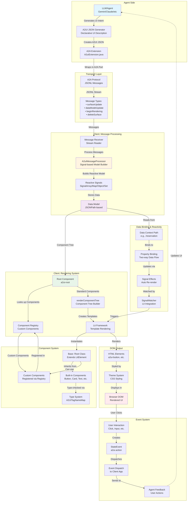
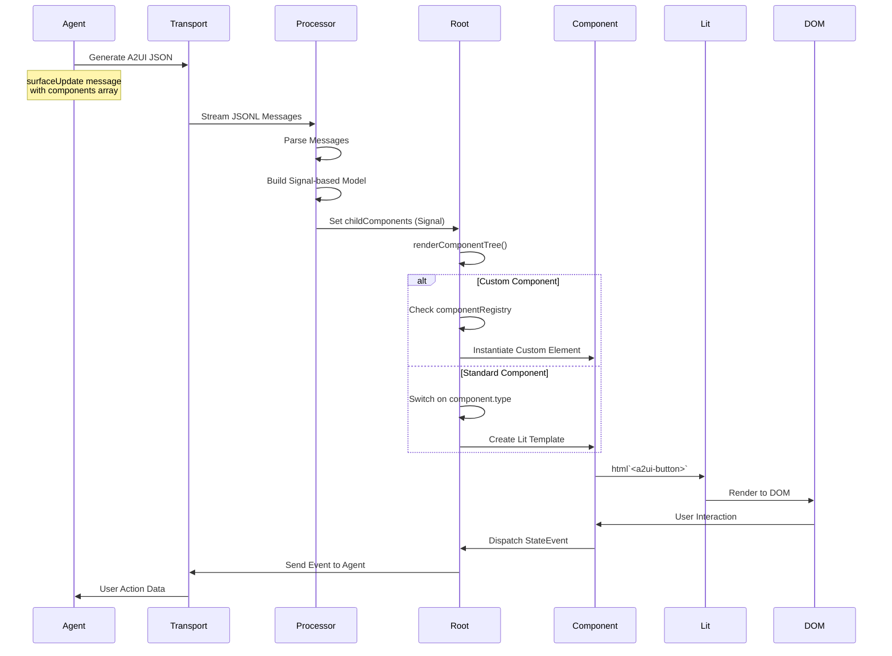
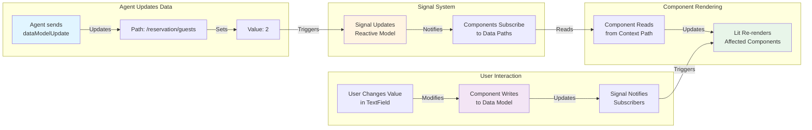
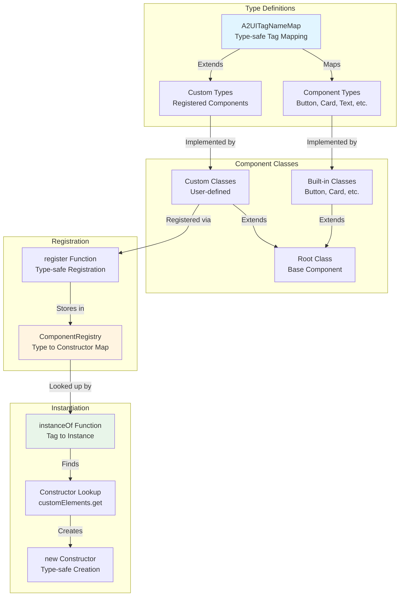
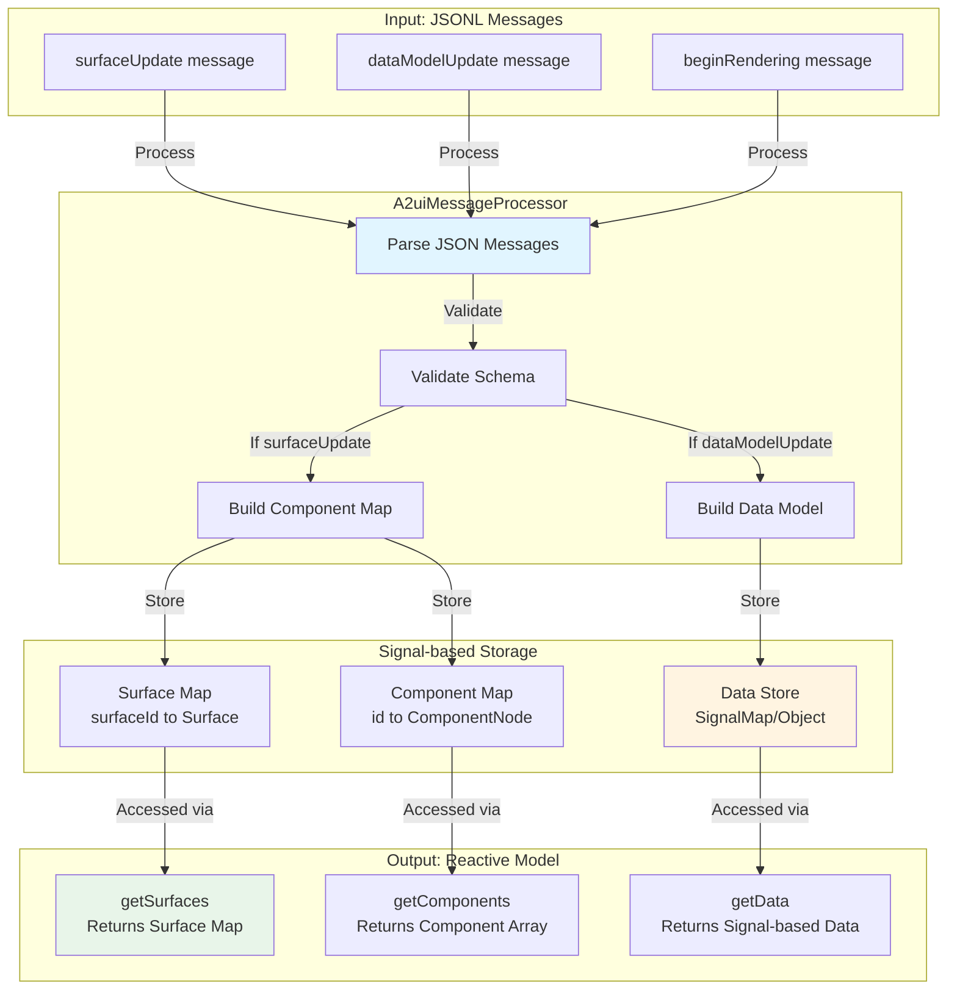
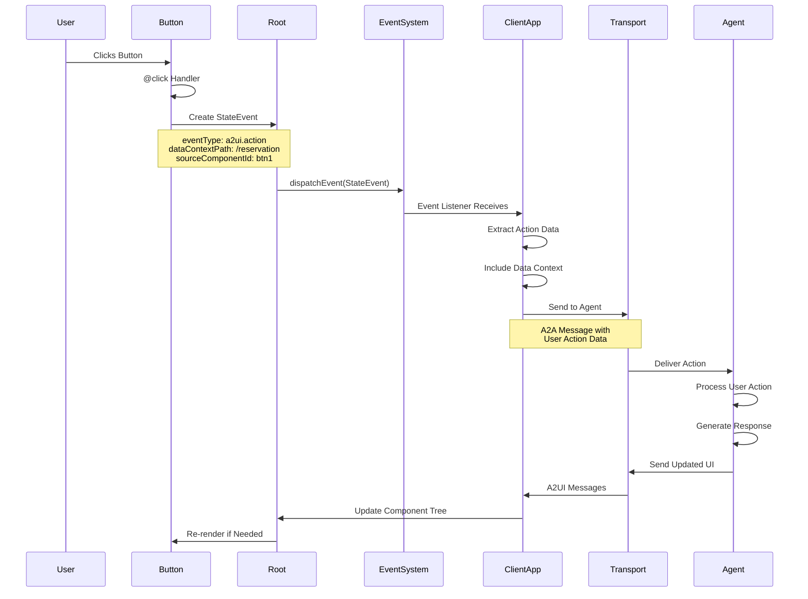

# A2UI Technical Architecture Diagram

## Complete System Flow

## Component Rendering Pipeline

## Data Binding Flow

## Component Type System

## Message Processing Details

## Event Flow: User Interaction to Agent

## Key Technical Concepts

### 1. **Declarative UI Generation**
- Agent generates JSON describing UI intent, not implementation
- Components are referenced by type (e.g., "Button") not code
- Client maps types to native implementations

### 2. **Reactive Data Model**
- Signal-based reactivity for efficient updates
- JSONPath-like data context paths
- Automatic re-rendering when data changes

### 3. **Type Safety**
- TypeScript ensures tag names map to correct classes
- Component properties are type-checked
- Custom components follow interface contracts

### 4. **Extensibility**
- Component registry for custom components
- Framework-agnostic (same JSON works across renderers)
- Open catalog system for component definitions

### 5. **Security**
- No code execution from agent
- Only pre-approved components can be rendered
- Data binding is declarative, not executable
