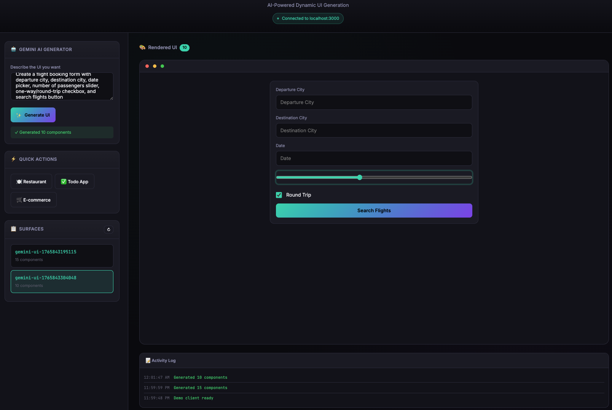
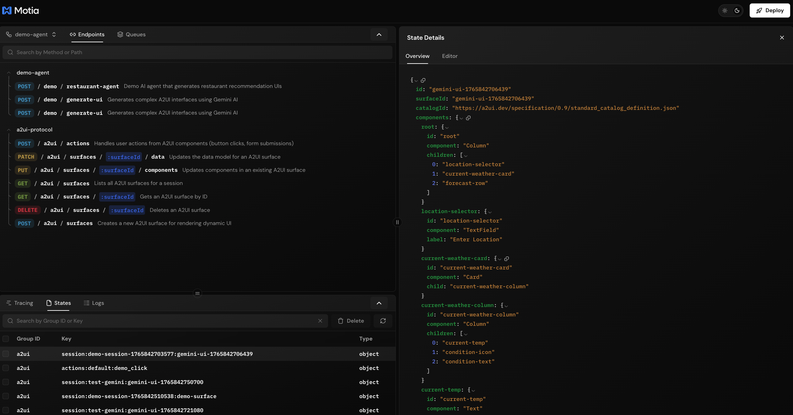
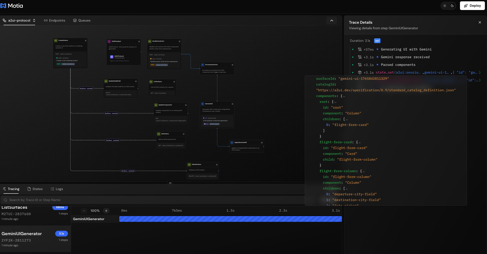
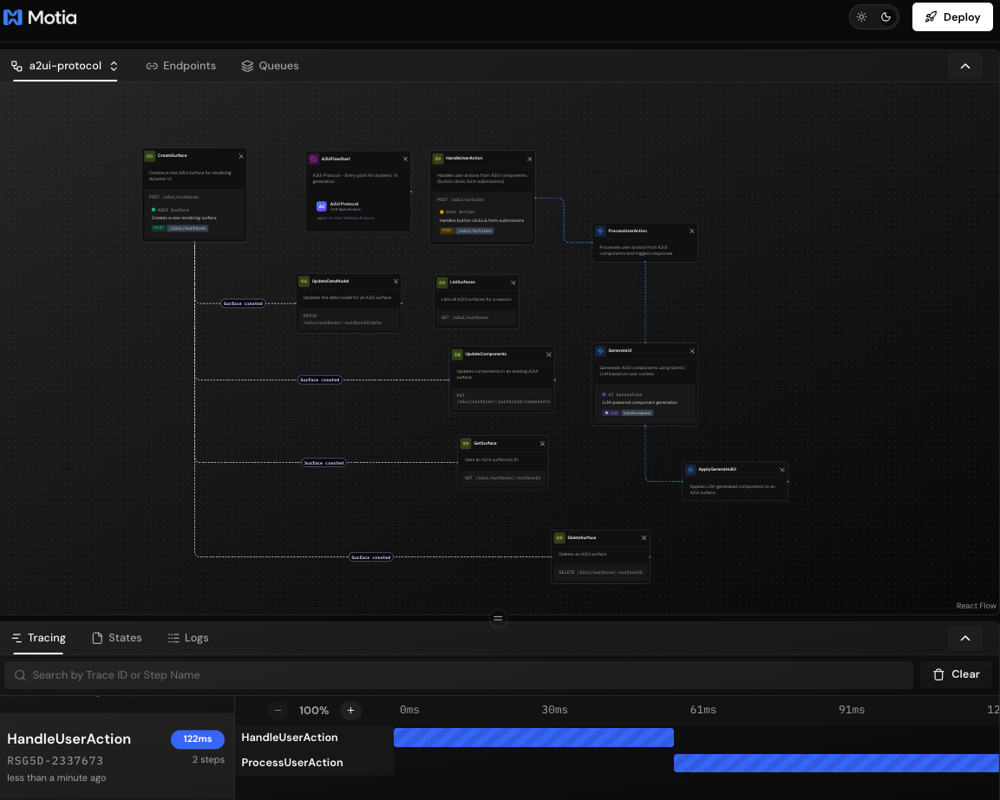
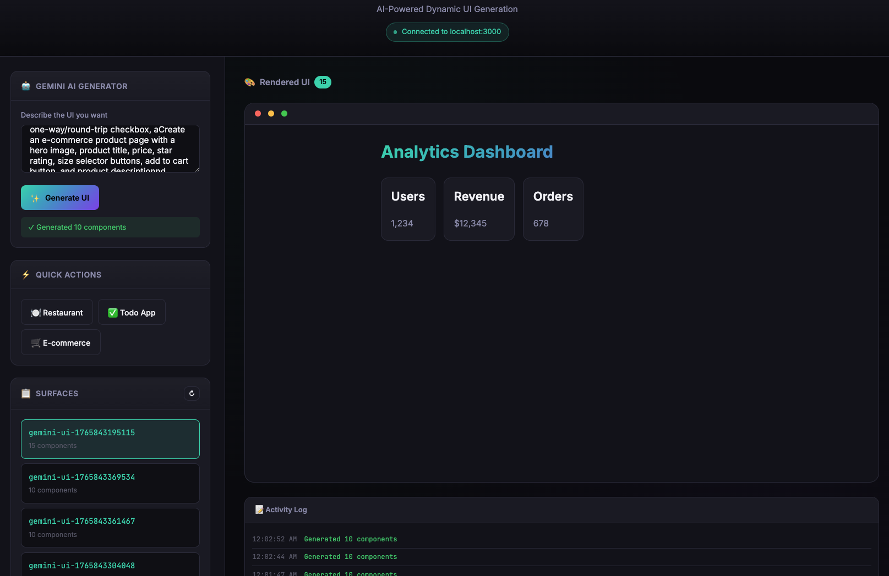

# A2UI + Motia: A Production-Ready Protocol Server

<p align="center">
  
</p>

<p align="center">
  <strong>AI-powered dynamic UI generation with Motia + Gemini</strong>
</p>

---

## Executive Summary

This proposal introduces **Motia** as a server-side orchestration layer for A2UI, providing a standardized, production-ready implementation of the A2UI protocol with built-in state management, real-time streaming, visual debugging, and horizontal scalability.

### 🎥 Demo Highlights

| Feature | Screenshot |
|---------|------------|
| **Gemini AI Generation** | Natural language → Complex UI |
| **Visual Workbench** | Debug flows in real-time |
| **Component Rendering** | Cards, buttons, forms, icons |

---

## The Problem

A2UI currently provides:
- ✅ Well-defined protocol specification (v0.8/v0.9)
- ✅ Client renderers (Lit, Angular, Flutter)
- ✅ Sample agents demonstrating the protocol

**However, there's a gap:**

Each agent implementation must:
- Manually manage surface state
- Implement custom streaming logic
- Handle session isolation independently
- Build observability from scratch
- Wire up event handling ad-hoc

This leads to:
- **Duplicated effort** across agent implementations
- **Inconsistent behavior** between different agents
- **Limited visibility** into agent-UI interactions
- **Difficult debugging** of streaming protocols

---

## The Solution: Motia-Based A2UI Server

[Motia](https://motia.dev) is an event-driven workflow framework that provides the missing server infrastructure for A2UI.

### Live Demo: Weather Dashboard Generation

<p align="center">
  
</p>

*A single prompt generates a complete weather dashboard with temperature, forecast cards, and location selector*

### Architecture

```
┌─────────────────────────────────────────────────────────────────┐
│                         A2UI Ecosystem                          │
├─────────────────────────────────────────────────────────────────┤
│                                                                 │
│  ┌──────────────┐    ┌──────────────┐    ┌──────────────┐      │
│  │   Flutter    │    │     Lit      │    │   Angular    │      │
│  │   Renderer   │    │   Renderer   │    │   Renderer   │      │
│  └──────┬───────┘    └──────┬───────┘    └──────┬───────┘      │
│         │                   │                   │               │
│         └───────────────────┼───────────────────┘               │
│                             │                                   │
│                    A2UI Protocol (JSONL)                        │
│                             │                                   │
│         ┌───────────────────┴───────────────────┐               │
│         │                                       │               │
│  ┌──────▼───────┐                      ┌───────▼──────┐        │
│  │    Motia     │◄────── NEW ─────────►│   Python     │        │
│  │    Server    │                      │ ADK Agents   │        │
│  └──────────────┘                      └──────────────┘        │
│         │                                                       │
│  ┌──────▼───────────────────────────────────────────────┐      │
│  │                   Motia Features                      │      │
│  │  • Event-driven steps    • Visual Workbench          │      │
│  │  • State management      • Real-time streams         │      │
│  │  • Session isolation     • LLM integration           │      │
│  │  • Horizontal scaling    • Observability             │      │
│  └──────────────────────────────────────────────────────┘      │
│                                                                 │
└─────────────────────────────────────────────────────────────────┘
```

---

## Key Features

### 1. 🤖 Gemini AI Integration

Generate complex UIs from natural language prompts:

<p align="center">
  
</p>

*Flight booking form with city inputs, date picker, passenger slider, and search button - all from a single prompt*

```typescript
// POST /demo/generate-ui
{
  "prompt": "Create a flight booking form with departure city, destination, date picker, passengers slider",
  "sessionId": "demo"
}
```

**Response:**
```json
{
  "surfaceId": "gemini-ui-1234567890",
  "componentCount": 10,
  "generatedAt": "2025-12-15T23:53:34.333Z"
}
```

### 2. 📊 Visual Workbench

See your A2UI flows as interactive diagrams with real-time tracing:

<p align="center">
  
</p>

*The Workbench shows step execution, event flow, and state changes in real-time*

### 3. Event-Driven Step Architecture

Each A2UI operation is a discrete, testable step:

```typescript
// create-surface.step.ts
export const config: ApiRouteConfig = {
  type: 'api',
  name: 'CreateSurface',
  method: 'POST',
  path: '/a2ui/surfaces',
  emits: ['a2ui.surface.created'],
  flows: ['a2ui-protocol'],
}

export const handler: ApiRouteHandler = async (req, { emit, state, logger }) => {
  const surface = await state.set('surface', surfaceId, data)
  await emit({ topic: 'a2ui.surface.created', data: surface })
  return { status: 201, body: surface }
}
```

### 4. Production-Ready Infrastructure

| Capability | Implementation |
|------------|----------------|
| State Management | Redis with in-memory fallback |
| Event Queue | BullMQ for reliable processing |
| Real-time Streams | WebSocket with auth support |
| Session Isolation | Per-session state namespacing |
| Observability | Structured logging, tracing |
| Scaling | Horizontal via Redis adapters |

---

## REST API Endpoints

The Motia implementation exposes a complete REST API:

| Method | Endpoint | Description |
|--------|----------|-------------|
| POST | `/a2ui/surfaces` | Create surface |
| GET | `/a2ui/surfaces` | List surfaces |
| GET | `/a2ui/surfaces/:id` | Get surface |
| PUT | `/a2ui/surfaces/:id/components` | Update components |
| PATCH | `/a2ui/surfaces/:id/data` | Update data model |
| DELETE | `/a2ui/surfaces/:id` | Delete surface |
| POST | `/a2ui/actions` | Handle user action |
| POST | `/demo/generate-ui` | **Gemini AI generation** |
| POST | `/demo/restaurant-agent` | Demo agent |

---

## Demo Results

### Generated UI Examples

| Prompt | Components | Result |
|--------|------------|--------|
| "Create a todo list app" | 19 | Task input, checkboxes, progress bar |
| "E-commerce product page" | 18 | Hero image, price, size buttons, cart |
| "Flight booking form" | 10 | City fields, date, passengers, search |
| "Analytics dashboard" | 23 | 4 stat cards with icons |
| "Weather dashboard" | 22 | Current temp, 3-day forecast |

### Interactive Demo Client

<p align="center">
  
</p>

*The demo client renders generated A2UI components with proper styling*

---

## Benefits

### For Agent Developers

| Before | After |
|--------|-------|
| Write custom state management | Use `state.set()` / `state.get()` |
| Implement streaming from scratch | Subscribe to built-in streams |
| Debug with console.log | Visual Workbench + structured logs |
| Manual session handling | Automatic session isolation |

### For the A2UI Ecosystem

1. **Reference Implementation**: A canonical server that demonstrates best practices
2. **Interoperability Testing**: Run any client against the Motia server
3. **Faster Onboarding**: Visual tools help developers understand the protocol
4. **Production Path**: From demo to production with the same codebase

### For LLM Integration

1. **Structured Prompts**: Steps provide clear context boundaries for LLMs
2. **Streaming Support**: Handle token-by-token generation naturally
3. **Error Recovery**: Event-driven architecture supports retries and fallbacks

---

## Quick Start

```bash
# Clone the repository
git clone https://github.com/google/A2UI.git
cd A2UI/server/motia

# Install dependencies
npm install

# Set Gemini API key (optional)
echo "GEMINI_API_KEY=your_key" > .env

# Start the server
npm run dev
```

This starts:
- **Motia Server**: http://localhost:3000
- **Workbench UI**: http://localhost:3000

### Try the Demo

```bash
# In another terminal, serve the demo client
npx serve public -p 8080

# Open http://localhost:8080/demo.html
```

---

## Integration Options

### Option A: Standalone Server

Use Motia as the complete A2UI backend:

```
[Client] ←→ [Motia A2UI Server] ←→ [Gemini LLM]
```

### Option B: Protocol Gateway

Motia as a gateway between clients and existing agents:

```
[Client] ←→ [Motia Gateway] ←→ [Python ADK Agents]
```

### Option C: Embedded Steps

Add Motia steps to existing backends:

```typescript
import { createSurfaceStep } from '@a2ui/motia-steps'

// Register in your existing Motia app
app.registerStep(createSurfaceStep)
```

---

## Proposed Additions to A2UI

1. **New directory**: `server/motia/` containing the implementation ✅
2. **Documentation**: Integration guide in `docs/guides/motia-integration.md`
3. **Sample update**: Option to use Motia server in existing demos
4. **CI/CD**: Test clients against Motia server for protocol compliance

---

## Next Steps

1. **Review**: Technical review of the Motia implementation
2. **Integration**: Merge into main A2UI repository
3. **Documentation**: Add to official A2UI docs
4. **Samples**: Update demos to optionally use Motia backend

---

## About Motia

[Motia](https://motia.dev) is an open-source, event-driven backend framework designed for:
- Complex workflow orchestration
- Real-time applications
- LLM-powered systems
- Visual debugging and monitoring

It's Apache 2.0 licensed and actively maintained.

---

## Appendix: File Structure

```
server/motia/
├── motia.config.ts           # Framework configuration
├── package.json
├── tsconfig.json
├── README.md
├── .env                      # GEMINI_API_KEY
│
├── public/                   # Demo assets
│   ├── demo.html             # Interactive client
│   ├── a2ui-demo.png         # Screenshots
│   └── ...
│
├── steps/
│   ├── a2ui/                 # Core protocol steps
│   │   ├── flow-start.step.ts
│   │   ├── create-surface.step.ts
│   │   ├── update-components.step.ts
│   │   ├── generate-ui.step.ts
│   │   └── ...
│   │
│   ├── streams/              # Real-time streams
│   │   ├── a2ui-surface.stream.ts
│   │   └── a2ui-message.stream.ts
│   │
│   └── demo/                 # Demo agents
│       ├── restaurant-agent.step.ts
│       └── gemini-ui-generator.step.ts
│
└── docs/
    ├── architecture.md
    ├── getting-started.md
    └── api-reference.md
```

---

<p align="center">
  <strong>A2UI + Motia = Production-Ready AI-Powered UIs</strong>
</p>

*Prepared by: [Your Name]*  
*Date: December 2025*
