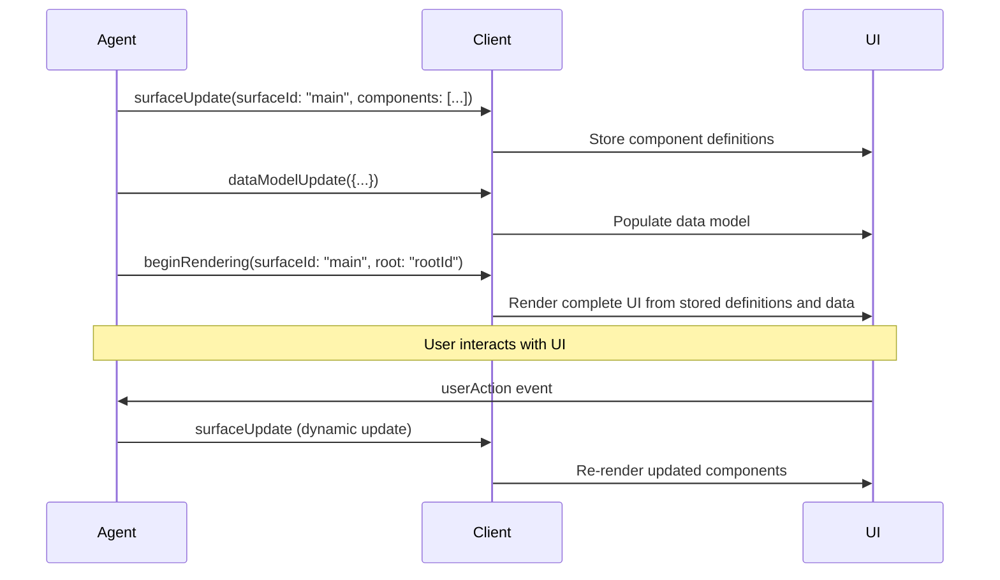

# Core Concepts

Understanding A2UI's architecture is key to building robust agent-driven interfaces. This section covers the fundamental concepts that power the protocol.

## The Big Picture

A2UI is built around three core ideas:

1. **Streaming Messages**: UI updates are sent as a stream of JSON messages
2. **Declarative Components**: UIs are described, not programmed
3. **Data Binding**: UI structure is separate from application state

## Key Components

### Surfaces

A **surface** is a logical container for a set of UI components. Think of it as a canvas where the agent paints the interface.

- Each surface has a unique ID (e.g., `"main"`, `"sidebar"`)
- A surface is implicitly created when the client receives the first `surfaceUpdate` for a new `surfaceId`.
- Surfaces can be deleted with `deleteSurface` messages
- Your app can have multiple surfaces active at once

**Example:** An email agent might create separate surfaces for the inbox list, email preview, and compose dialog.

### Components

**Components** are the building blocks of the UI. Each component represents a specific UI element:

- `Text` - Display text content
- `Button` - Interactive buttons
- `TextField` - Text input fields
- `Card` - Container with elevation/border
- `Row` / `Column` - Layout containers
- `Image`, `Icon`, `Slider`, etc.

Components are defined in the **Standard Catalog**, which specifies what components are available and what properties they support.

### The Data Model

The **data model** is a JSON object that holds the application state for a surface. Components can bind to paths in this model using **JSON Pointer** syntax.

**Example:**

```json
{
  "user": {
    "name": "Alice",
    "email": "alice@example.com"
  },
  "items": [
    {"id": 1, "title": "First Item"},
    {"id": 2, "title": "Second Item"}
  ]
}
```

A component can bind to `/user/name` to display "Alice" or `/items/0/title` to display "First Item".

## The Message Types

A2UI defines four message types that flow from server to client:

### 1. surfaceUpdate

Adds or updates components in a surface. The first `surfaceUpdate` for a given `surfaceId` implicitly creates that surface.

```json
{
  "surfaceUpdate": {
    "surfaceId": "main",
    "components": [
      {
        "id": "greeting",
        "component": {
          "Text": {
            "text": {"literalString": "Hello, World!"}
          }
        }
      }
    ]
  }
}
```

### 2. dataModelUpdate

Updates the data model for a surface using a key-value adjacency list.

```json
{
  "dataModelUpdate": {
    "surfaceId": "main",
    "path": "/user",
    "contents": [
      { "key": "name", "valueString": "Alice" }
    ]
  }
}
```

### 3. beginRendering

Signals to the client that it has enough information to perform the initial render of a surface.

```json
{
  "beginRendering": {
    "surfaceId": "main",
    "root": "greeting"
  }
}
```

### 4. deleteSurface

Removes a surface and all its components.

```json
{
  "deleteSurface": {
    "surfaceId": "main"
  }
}
```

## The Rendering Cycle

Here's how a typical A2UI interaction flows:



### Step-by-Step

1. **Define Components**: Agent sends one or more `surfaceUpdate` messages with component definitions. The client stores these but does not render yet.
2. **Populate Data**: Agent sends `dataModelUpdate` messages to provide the necessary data for the components.
3. **Begin Rendering**: Agent sends `beginRendering`, telling the client to now build and display the UI using the components and data it has received.
4. **Render**: Client renders the UI using native widgets.
5. **User Interaction**: User clicks a button, fills a form, etc.
6. **Send Action**: Client sends a `userAction` message to the agent.
7. **Dynamic Update**: Agent responds with new `surfaceUpdate` or `dataModelUpdate` messages.
8. **Re-render**: Client updates the UI to reflect the changes.

## Progressive Rendering

A2UI is designed for **streaming**. The agent doesn't need to generate the entire UI at once.

**Traditional approach:**
```
Agent: [thinks for 3 seconds]
Agent: Here's your complete UI! [JSON blob]
Client: [renders everything at once]
```

**A2UI approach:**
```
Agent: Here's the header...
Client: [stores header definition]

Agent: Here's the main content structure...
Client: [stores content definition]

Agent: Here's the data for the content...
Client: [stores data]

Agent: Okay, render it now.
Client: [renders header and content with data instantly]
```

This creates a more responsive user experience, especially with slow LLMs or complex UIs.

## Why This Design?

### LLM-Friendly

The flat message structure and incremental updates are easy for LLMs to generate:

- No need to generate perfect JSON in one shot
- Can build UI piece by piece
- Easy to correct mistakes with subsequent messages

### Secure

Since components are declarative descriptions (not code), the client is in full control:

- No arbitrary code execution
- Client validates against schema
- Component catalog acts as a whitelist

### Portable

The abstract component model means one agent response works everywhere:

- Same JSON renders on web and mobile
- Client chooses the native widget implementation
- Styling is controlled by the client app

## Next Steps

Now that you understand the core concepts, dive deeper into specific topics:

- **[Data Flow](data-flow.md)**: How messages flow through the system
- **[Component Structure](components.md)**: Understanding the adjacency list model
- **[Data Binding](data-binding.md)**: How components connect to data
