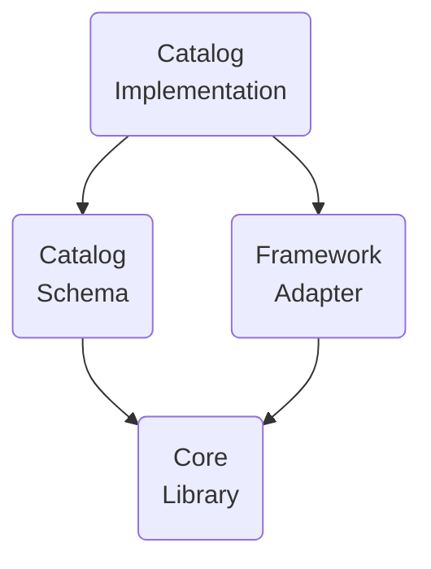

# Glossary

## Generative UI terms

Terms, not required by A2UI protocol, but are commonly used in the context of Generative UI.

## A2UI protocol terms

Terms, required by A2UI protocol.

### A2UI agent and A2UI renderer

The A2UI protocol enables conversation between agent and renderer:
1. Renderer provides UI capabilities in the form of A2UI catalog and instructions on how to use it.
2. Agent iterates on the loop:
    - Provides UI and functions to call, taking into account the received catalog
    - Receives user input, communicated by renderer
    - Updates data to show in UI

While the protocol is designed for **AI-empowered agents**, it can work with deterministic agents as well. For example, an agent that tests the renderer, may be noAI-agent.

In case the agent is stateless or does not guarantee to preserve the catalog, the renderer should provide the catalog with every message.

And, sometimes, an agent is using a predefined catalog, thus forcing the renderers to either support this catalog or use an adapter. 

### Catalog

1. Itemized renderer capabilities:
    - List of  components that the agent can use to generate UI
    - List of functions that can be invoked by renderer
    - Styles and themes
2. Explanation on how the renderer capabilities should be used.

### Basic Catalog

A catalog maintained by the A2UI team to get up and running quickly with A2UI.

### Domain-specific components

It is observed that depending on use case, catalog components may be more or less specific to domain:

- **Less specific**:

  Basic UI primitives like buttons, labels, rows, columns, option-selectors and so on. 

- **More specific**:

  Components like HotelCheckout or FlightSelector.

### A2UI framework

A front-end UI library that provides A2UI renderer and API to define catalog 

### Agent architecture

There are options for A2UI agent:

- **Same-process agent**:

  Agent and renderer reside in one process of a client side application. Example: desktop Flutter application.

- **Server-side agent**:

  Renderer resides on the box that displays UI, and agent resides on another box (server).

- **Orchestrator agent**:

  The central orchestrator manages interactions between a user and several specialized sub-agents. The orchestrator can be in the same process or on the server.

- **Pulling or pushing**:

  An agent can wait for messages/requests from the renderer, or push messages/requests to it.

- **Stateful or stateless**:

  Agents can preserve state or be stateless.

- **Something else**:

  In addition to the above options, there is possibility for any custom variation.

### Renderer stack

Functionality of A2UI renderer consists of layers, that can be developed separately and reused:

- **Core Library**:
  
  Set of primitives, needed to describe catalog and to interact with the agent.

- **Catalog Schema**:
  
  Concrete definition of catalog.

- **Framework adapter**:
  
  Code that implements the execution of the agent’s instructions in a concrete framework.
  For example:
  JavaScript core and catalogs may be adapted to Angular, Electron and Lit frameworks.
  Dart core and catalogs may be adapted to Flutter and Jaspr frameworks.

- **Catalog Implementation**:
  
  Implementation of the catalog schema for the selected framework.

