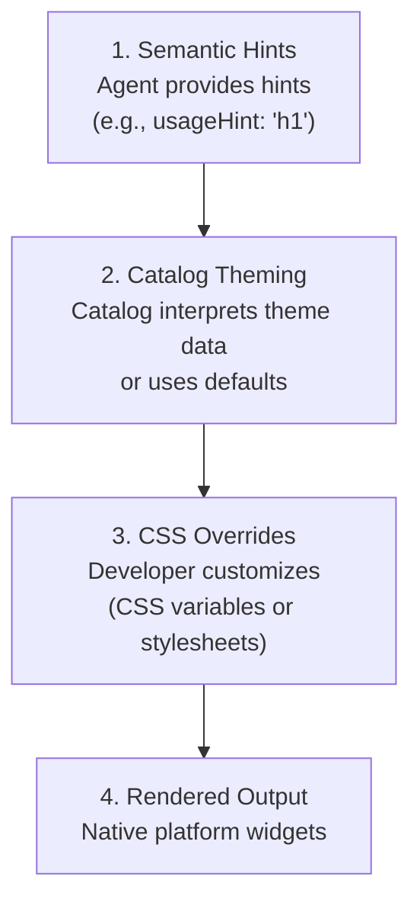

# Theming & Styling

Customize the look and feel of A2UI components to match your brand.

## The A2UI Styling Philosophy

A2UI follows a **renderer-controlled styling** approach by default, but allows for flexibility through catalogs:

- **Agents describe *what* to show** (components and structure)
- **Renderers decide *how* it looks** (colors, fonts, spacing)

However, the protocol is flexible enough to allow agents to influence styling when needed.

### Protocol-Level Theme Support

The A2UI protocol allows for an arbitrary `theme` property in the `createSurface` message. This property is defined as `z.any().optional()` in the Zod schema, meaning the agent can pass any JSON structure that the client renderer and catalog understand.

See the schema definition in [server-to-client.ts](file:///work/google/a2ui/renderers/web_core/src/v0_9/schema/server-to-client.ts#L31).

## Styling Layers

A2UI styling works in layers:



## Layer 1: Semantic Hints

Agents provide semantic hints (not visual styles) to guide rendering:

```json
{
  "id": "title",
  "component": {
    "Text": {
      "text": {"literalString": "Welcome"},
      "usageHint": "h1"
    }
  }
}
```

**Common `usageHint` values:**

- Text: `h1`, `h2`, `h3`, `h4`, `h5`, `body`, `caption`
- Other components have their own hints (see [Component Reference](../reference/components.md))

The client renderer maps these semantic hints to actual visual styles based on your theme and design system.

## Layer 2: Catalog Theming

Theming is a responsibility of the catalog implementation. Each catalog can have whatever theming solution it deems appropriate.

When a catalog is created, it can optionally define a `themeSchema` using Zod to validate the `theme` property received from the agent. This allows the catalog to enforce a specific structure for theme overrides sent by the agent.

See the `Catalog` class and `themeSchema` in [catalog/types.ts](file:///work/google/a2ui/renderers/web_core/src/v0_9/catalog/types.ts#L147).

### The Basic Catalog Theming

The *basic catalog* provided by the default A2UI renderers supports theming via a simple CSS stylesheet with overrides.

It injects a default stylesheet with CSS variables. These variables use the `:where()` CSS selector to ensure zero specificity. This means developers can easily override these variables in their application's global CSS without fighting specificity issues.

For example, to override the primary color, you can simply add this to your app's CSS:

```css
:root {
  --a2ui-color-primary: #ff5722;
}
```

See the default styles in [default.ts](file:///work/google/a2ui/renderers/web_core/src/v0_9/basic_catalog/styles/default.ts).

**See working examples:**

- [Lit samples](https://github.com/google/a2ui/tree/main/samples/client/lit)
- [Angular samples](https://github.com/google/a2ui/tree/main/samples/client/angular)
- [Flutter GenUI docs](https://docs.flutter.dev/ai/genui)

## Layer 3: Component Overrides

Beyond global theming, you can override styles for specific components:

**Web renderers:**

- CSS custom properties (CSS variables) for fine-grained control
- Standard CSS selectors for component-specific overrides

**Flutter:**

- Widget-specific theme overrides via `ThemeData`

TODO: Add detailed component override examples for each platform.

## Common Styling Features

### Dark Mode

A2UI renderers typically support automatic dark mode based on system preferences:

- Auto-detect system theme (`prefers-color-scheme`)
- Manual light/dark theme selection
- Custom dark theme configuration

TODO: Add dark mode configuration examples.

### Responsive Design

A2UI components are responsive by default. You can further customize responsive behavior:

- Media queries for different screen sizes
- Container queries for component-level responsiveness
- Responsive spacing and typography scales

TODO: Add responsive design examples.

### Custom Fonts

Load and use custom fonts in your A2UI application:

- Web fonts (Google Fonts, etc.)
- Self-hosted fonts
- Platform-specific font loading

TODO: Add custom font examples.

## Best Practices

### 1. Use Semantic Hints, Not Visual Properties

Agents should provide semantic hints (`usageHint`), never visual styles:

```json
// ✅ Good: Semantic hint
{
  "component": {
    "Text": {
      "text": {"literalString": "Welcome"},
      "usageHint": "h1"
    }
  }
}

// ❌ Bad: Visual properties (not supported)
{
  "component": {
    "Text": {
      "text": {"literalString": "Welcome"},
      "fontSize": 24,
      "color": "#FF0000"
    }
  }
}
```

### 2. Maintain Accessibility

- Ensure sufficient color contrast (WCAG AA: 4.5:1 for normal text, 3:1 for large text)
- Test with screen readers
- Support keyboard navigation
- Test in both light and dark modes

### 3. Use Design Tokens

Define reusable design tokens (colors, spacing, etc.) and reference them throughout your styles for consistency.

### 4. Test Across Platforms

- Test your theming on all target platforms (web, mobile, desktop)
- Verify both light and dark modes
- Check different screen sizes and orientations
- Ensure consistent brand experience across platforms

## Next Steps

- **[Defining Your Own Catalog](defining-your-own-catalog.md)**: Build custom components with your styling
- **[Component Reference](../reference/components.md)**: See styling options for all components
- **[Client Setup](client-setup.md)**: Set up the renderer in your app
