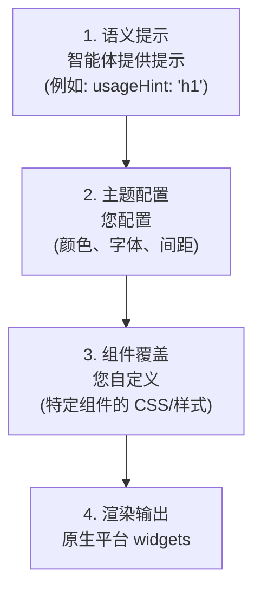

# 主题与样式

自定义 A2UI 组件的外观和感觉以匹配您的品牌。

## A2UI 样式哲学

A2UI 遵循 **客户端控制的样式** 方法：

- **智能体描述 *显示什么*** (组件和结构)
- **客户端决定 *它看起来如何*** (颜色、字体、间距)

这确保了：

- ✅ **品牌一致性**: 所有 UI 都匹配您应用的设计系统
- ✅ **安全性**: 智能体不能注入任意 CSS 或样式
- ✅ **无障碍性**: 您控制对比度、焦点状态和 ARIA 属性
- ✅ **平台原生感**: Web 应用看起来像 Web，移动应用看起来像移动应用

## 样式层级

A2UI 样式分层工作：



## 第 1 层：语义提示

智能体提供语义提示（非视觉样式）以指导客户端渲染：

```json
{
  "id": "title",
  "component": {
    "Text": {
      "text": {"literalString": "Welcome"},
      "usageHint": "h1"
    }
  }
}
```

**常见的 `usageHint` 值：**
- Text: `h1`, `h2`, `h3`, `h4`, `h5`, `body`, `caption`
- 其他组件有自己的提示（参见 [组件参考](../reference/components.md)）

客户端渲染器根据您的主题和设计系统将这些语义提示映射到实际的视觉样式。

## 第 2 层：主题配置

每个渲染器提供了一种全局配置设计系统的方法，包括：

- **颜色**: Primary, secondary, background, surface, error, success 等
- **排版**: 字体系列、大小、粗细、行高
- **间距**: 基础单位和比例 (xs, sm, md, lg, xl)
- **形状**: 圆角值
- **海拔 (Elevation)**: 用于深度的阴影样式

TODO: 添加特定平台的主题指南：

**Web (Lit):**
- 如何通过渲染器初始化配置主题
- 可用的主题属性

**Angular:**
- 与 Angular Material 主题的集成
- 独立的 A2UI 主题配置

**Flutter:**
- A2UI 如何使用 Flutter 的 `ThemeData`
- 自定义主题属性

**查看工作示例：**
- [Lit 示例](https://github.com/google/a2ui/tree/main/samples/client/lit)
- [Angular 示例](https://github.com/google/a2ui/tree/main/samples/client/angular)
- [Flutter GenUI 文档](https://docs.flutter.dev/ai/genui)

## 第 3 层：组件覆盖

除了全局主题之外，您还可以覆盖特定组件的样式：

**Web 渲染器：**
- 用于细粒度控制的 CSS 自定义属性（CSS 变量）
- 用于组件特定覆盖的标准 CSS 选择器

**Flutter:**
- 通过 `ThemeData` 进行 widget 特定的主题覆盖

TODO: 为每个平台添加详细的组件覆盖示例。

## 常见的样式功能

### 深色模式

A2UI 渲染器通常支持基于系统首选项的自动深色模式：

- 自动检测系统主题 (`prefers-color-scheme`)
- 手动浅色/深色主题选择
- 自定义深色主题配置

TODO: 添加深色模式配置示例。

### 响应式设计

A2UI 组件默认是响应式的。您可以进一步自定义响应式行为：

- 针对不同屏幕尺寸的媒体查询
- 针对组件级响应性的容器查询
- 响应式间距和排版比例

TODO: 添加响应式设计示例。

### 自定义字体

在您的 A2UI 应用程序中加载和使用自定义字体：

- Web 字体 (Google Fonts 等)
- 自托管字体
- 平台特定的字体加载

TODO: 添加自定义字体示例。

## 最佳实践

### 1. 使用语义提示，而非视觉属性

智能体应提供语义提示 (`usageHint`)，绝不提供视觉样式：

```json
// ✅ Good: 语义提示
{
  "component": {
    "Text": {
      "text": {"literalString": "Welcome"},
      "usageHint": "h1"
    }
  }
}

// ❌ Bad: 视觉属性（不支持）
{
  "component": {
    "Text": {
      "text": {"literalString": "Welcome"},
      "fontSize": 24,
      "color": "#FF0000"
    }
  }
}
```

### 2. 保持无障碍性

- 确保足够的颜色对比度（WCAG AA: 普通文本 4.5:1，大文本 3:1）
- 使用屏幕阅读器进行测试
- 支持键盘导航
- 在浅色和深色模式下进行测试

### 3. 使用设计令牌

定义可重用的设计令牌（颜色、间距等）并在整个样式中引用它们以保持一致性。

### 4. 跨平台测试

- 在所有目标平台（Web、移动、桌面）上测试您的主题
- 验证浅色和深色模式
- 检查不同的屏幕尺寸和方向
- 确保跨平台的一致品牌体验

## 下一步

- **[自定义组件](custom-components.md)**: 使用您的样式构建自定义组件
- **[组件参考](../reference/components.md)**: 查看所有组件的样式选项
- **[客户端设置](client-setup.md)**: 在您的应用中设置渲染器
