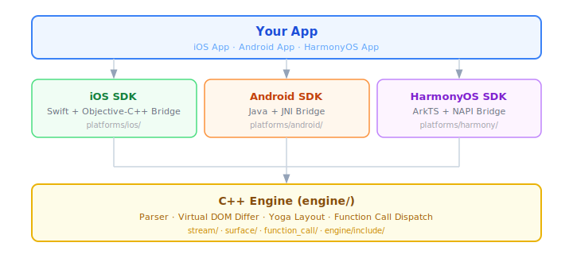

<div align="center">

# AGenUI

**Agent Generative UI — 全球首个覆盖 iOS、Android 和 HarmonyOS 的 A2UI 原生渲染引擎**

[](LICENSE)
[](#)
[](#)
[](#)
[](#)

[**在线 Demo**](https://genui.amap.com) · [**快速上手**](docs/QuickStart.md) · [**API 参考**](docs/API.md) · [**贡献指南**](CONTRIBUTING.md)

[English](README.md) | 中文

</div>

<div align="center">

*Demo 截图和 GIF 即将上线 — [立即体验在线 Demo](https://genui.amap.com)*

</div>

---

## 目录

- [什么是 AGenUI？](#什么是-agenui)
- [核心特性](#核心特性)
- [架构设计](#架构设计)
- [组件](#组件)
- [快速上手](#快速上手)
- [从源码构建](#从源码构建)
- [Playground 调试](#使用-playground-调试)
- [文档](#文档)
- [贡献指南](#贡献指南)
- [许可证](#许可证)

---

## 什么是 AGenUI？

**AGenUI** 是一个跨平台 SDK，能够在原生移动设备上实时渲染 AI 生成的 UI。它实现了 [Google 开源的 A2UI 协议](https://github.com/google/A2UI)——一种让 LLM 以流式 JSON 描述可交互界面的协议，底层由一个跨 iOS、Android 和 HarmonyOS 的**共享 C++ 渲染引擎**驱动。

<div align="center">

</div>

应用不再展示原始文本，而是渲染**可交互的卡片、表单、列表、媒体播放器等** —— 全部由结构化 LLM 输出驱动，以原生 UI 呈现，无需 WebView。


---

## 核心特性

- **实时流式渲染** — 随模型生成 token，组件增量出现并实时更新
- **22 个内置组件** — 18 个 A2UI 协议组件 + 4 个 SDK 扩展组件；支持通过自定义组件 API 注册私有组件
- **自定义组件 API** — 注册自己的原生组件，模型可通过名称直接调用
- **Function Call 集成** — 注册平台函数（同步或异步），模型可直接发起调用
- **Design Token 与主题** — 三端共享的中心化 Token 体系
- **日 / 夜间模式** — 原生支持亮色 / 暗色切换
- **开放核心模式** — 渲染引擎与全部内置组件在 MIT 协议下完全开源

---

## 架构设计

AGenUI 采用**共享 C++ 引擎 + 轻量平台适配层**的设计：

<div align="center">

</div>

| 路径 | 内容 |
|---|---|
| `engine/` | C++ 引擎 — 解析器、差分算法、布局、Function Call 框架 |
| `engine/include/` | 供平台桥接层消费的公开 C API |
| `platforms/ios/` | iOS SDK + Objective-C 桥接层 |
| `platforms/android/` | Android SDK + JNI 桥接层 |
| `platforms/harmony/` | HarmonyOS SDK + NAPI 桥接层 |
| `playground/` | 三端演示应用，用于开发与调试 |
| `scripts/` | 各平台构建脚本 |

---

## 组件

<div align="center">

</div>

### A2UI 协议组件

以下 18 个组件实现了 A2UI 协议规范，三端均支持。

| 组件 | 说明 |
|---|---|
| `Text` | 样式化文本，支持 h1–h5、body、caption 等变体 |
| `Image` | 网络图片，支持缩放模式与圆角 |
| `Icon` | 通过 Unicode / SVG 映射渲染图标 |
| `Divider` | 水平或垂直分隔线 |
| `Video` | 原生视频播放器，支持拖拽进度、控件自动隐藏 |
| `AudioPlayer` | 音频播放器，含进度条 |
| `Button` | 可点击按钮，触发 Action 事件 |
| `Row` | 水平弹性容器 |
| `Column` | 垂直弹性容器 |
| `Card` | 带阴影的卡片容器 |
| `List` | 可滚动列表，支持静态子项或模板驱动子项 |
| `Tabs` | 标签栏，支持可切换面板 |
| `Modal` | 原生对话框浮层 |
| `TextField` | 文本输入框，支持可选校验 |
| `CheckBox` | 布尔开关 |
| `Slider` | 数值范围输入 |
| `ChoicePicker` | 单选 / 多选选择器 |
| `DateTimeInput` | 日期与时间选择器 |

### SDK 内置扩展组件

以下 4 个组件随 SDK 捆绑发布，不属于 A2UI 协议规范。

| 组件 | 说明 |
|---|---|
| `Table` | 数据表格，使用 Yoga 子布局 |
| `Carousel` | 图片 / 内容轮播 |
| `Web` | 内嵌 WebView |
| `RichText` | HTML 富文本渲染 |

### Playground 示例组件

以下 3 个组件在 Playground 中注册，用于演示如何通过自定义组件 API 接入第三方或重依赖组件，不包含在 SDK 中。

| 组件 | 说明 |
|---|---|
| `Chart` | 柱状图、折线图、饼图 |
| `Markdown` | Markdown 渲染，支持流式输出 |
| `Lottie` | Lottie 动画播放 |

你可以在运行时使用相同的 API 注册自己的组件，参见各平台快速上手章节。

---

## 快速上手

> 完整安装与使用指南：[docs/QuickStart.zh-CN.md](docs/QuickStart.zh-CN.md)  
> 完整 SDK API 参考：[docs/API.zh-CN.md](docs/API.zh-CN.md)

### Android

```bash
./scripts/android/build.sh   # 输出到 dist/android/release/AGenUI-Client-Android-release.aar
```

将 AAR 复制到应用的 `libs/` 目录，然后声明依赖：

```groovy
// build.gradle (app)
dependencies {
    implementation fileTree(dir: 'libs', include: ['*.aar'])
}
```

```java
// Application.onCreate()
AGenUI.getInstance().initialize(this);

// Activity：创建 Surface 并接收 SSE 数据块
SurfaceManager surfaceManager = new SurfaceManager(this);
surfaceManager.addListener(new ISurfaceManagerListener() {
    @Override
    public void onCreateSurface(Surface surface) {
        runOnUiThread(() -> container.addView(surface.getContainer()));
    }
    @Override public void onDeleteSurface(Surface surface) {}
    @Override public void onReceiveActionEvent(String event) {}
});
surfaceManager.beginTextStream();
surfaceManager.receiveTextChunk(chunk); // 每收到一个 SSE 数据块调用一次
surfaceManager.endTextStream();
```

> 完整接入指南（本地 Maven 发布、主题配置）：[docs/QuickStart.md](docs/QuickStart.md)

---

### iOS

**1. 添加 Pod 依赖**

```ruby
pod 'AGenUI', '0.9.8'
```

**2. 初始化并使用**

```swift
import AGenUI

let surfaceManager = SurfaceManager()
surfaceManager.addListener(self) // self 需遵循 SurfaceManagerListener 协议

// 接收流式数据
surfaceManager.beginTextStream()
surfaceManager.receiveTextChunk(chunk)
surfaceManager.endTextStream()
```

> 完整接入指南（监听器协议、Surface 布局、主题配置）：[docs/QuickStart.md](docs/QuickStart.md)

---

### HarmonyOS

**方式 A：通过 ohpm 安装**

```bash
ohpm install @agenui/agenui
```

**方式 B：本地构建**

```bash
./scripts/harmony/build.sh   # 输出到 dist/harmony/release/agenui.har
```

```typescript
import { AGenUI, AGenUIContainer, SurfaceManager, ISurfaceManagerListener, Surface } from '@agenui/agenui';
import { common } from '@kit.AbilityKit';

class SurfaceListenerImpl implements ISurfaceManagerListener {
  onCreateSurface(surface: Surface): void { /* 将 surfaceId 绑定到 AGenUIContainer */ }
  onDeleteSurface(surface: Surface): void {}
  onReceiveActionEvent(event: string): void {}
}

@Entry
@Component
struct MyPage {
  @State surfaceId: string = '';
  private surfaceManager: SurfaceManager | null = null;

  aboutToAppear(): void {
    const context = getContext(this) as common.UIAbilityContext;
    this.surfaceManager = new SurfaceManager(context);
    this.surfaceManager.addListener(new SurfaceListenerImpl(this));
  }

  build() {
    Column() {
      if (this.surfaceId) {
        AGenUIContainer({ surfaceId: this.surfaceId }).width('100%').height('100%')
      }
    }
  }
}
```

从 LLM 流式接口传入数据块：

```typescript
this.surfaceManager?.receiveTextChunk(chunk); // 每收到一个 SSE 数据块调用一次
```

> 完整接入指南（监听器、主题配置、资源释放）：[docs/QuickStart.md](docs/QuickStart.md)

---

## 从源码构建

所有构建脚本位于 `scripts/` 目录。`engine/` 中的 C++ 引擎会自动编译，无需单独准备。

### 前提条件

| 平台 | 工具链 |
|---|---|
| Android | Android Studio Hedgehog+、NDK 27.3.13750724、API 35 SDK、JDK 11 |
| iOS | Xcode 15+、CocoaPods、CMake |
| HarmonyOS | DevEco Studio 4.0+、ohpm |

### Android

```bash
# Release AAR（默认）
./scripts/android/build.sh

# Debug AAR
./scripts/android/build.sh --debug

# 发布到本地 Maven（~/.m2）
./scripts/android/build.sh --publish-local

# 构建前清理
./scripts/android/build.sh --clean
```

AAR 输出到 `dist/android/release/`。

### iOS

```bash
# XCFramework（Release，默认）
./scripts/ios/build.sh

# 单架构 Framework，Debug
./scripts/ios/build.sh -t framework -c Debug

# 强制 pod install 后构建
./scripts/ios/build.sh --pod-install
```

### HarmonyOS

```bash
# HAR 包（Release，默认）
./scripts/harmony/build.sh

# Debug 构建
./scripts/harmony/build.sh --mode debug

# 自定义输出目录
./scripts/harmony/build.sh -o /path/to/output
```

---

## 使用 Playground 调试

每个平台都有一个独立的 Playground 应用，直接引用 SDK 源码——无需先发布包。

### Android Playground

在 Android Studio 中打开 `playground/android/`。可通过 `gradle.properties` 切换两种依赖模式：

```properties
# 源码模式：SDK 修改立即生效（推荐用于 SDK 开发）
agenui.sdk.source=true

# AAR 模式：SDK 编译一次打包为 AAR（推荐仅调试 Playground 时使用）
agenui.sdk.source=false
```

当需要在 SDK 内部打断点，或同时迭代 SDK 和 Playground 时，切换为 `source=true`。

### iOS Playground

执行 `pod install` 后，在 Xcode 中打开 `platforms/ios/Playground/Playground.xcworkspace`。工作区同时包含 SDK 源码和 Playground target，Xcode 调试器可以直接步入 SDK 代码。

### HarmonyOS Playground

在 DevEco Studio 4.0+ 中打开 `playground/harmony/`。项目通过 `srcPath` 引用 `platforms/harmony/agenui/`，因此对 SDK 源码的任何修改在下次构建时都会自动生效。

```
playground/harmony
└── entry（Demo 应用）
    └── @agenui/agenui → file:../../../platforms/harmony/agenui  （实时源码链接）
```

---

## 文档

| 文档 | 说明 |
|---|---|
| [快速上手](docs/QuickStart.zh-CN.md) | 三端分步接入指南 |
| [API 参考](docs/API.zh-CN.md) | 完整 SDK API——引擎、SurfaceManager、组件、Function Call |
| [项目结构](docs/PROJECT_STRUCTURE.zh-CN.md) | 目录布局与模块职责说明 |
| [A2UI 协议](https://github.com/google/A2UI) | 本 SDK 实现的上游 JSON 协议 |
| [贡献指南](CONTRIBUTING.md) | 代码风格、PR 流程与审查规范 |

---

## 贡献指南

欢迎各种形式的贡献——Bug 修复、新组件、平台改进、文档完善和测试覆盖。

提交 Pull Request 前，请阅读 [CONTRIBUTING.md](CONTRIBUTING.md) 了解完整工作流、代码风格规范（C++、Swift、Java 遵循 Google Style Guide，ArkTS 遵循 OpenHarmony 规范）以及 PR 检查清单。

**简要流程：**

1. Fork 仓库，从 `main` 创建分支：`fix/123-my-fix` 或 `feat/my-feature`
2. 完成修改，在适当位置补充测试
3. 在受影响的平台上本地构建并测试
4. 向 `main` 提交 PR，清晰描述*做了什么*以及*为什么*
5. 至少需要一位维护者审批才能合并

对于较大范围的变更——新平台支持、重大引擎重构、新组件品类——请先提 Issue 对齐方案，再开始编写代码。

---

## 许可证

AGenUI 基于 [MIT 许可证](LICENSE) 发布。

Copyright © 2026 AutoNavi Inc.
