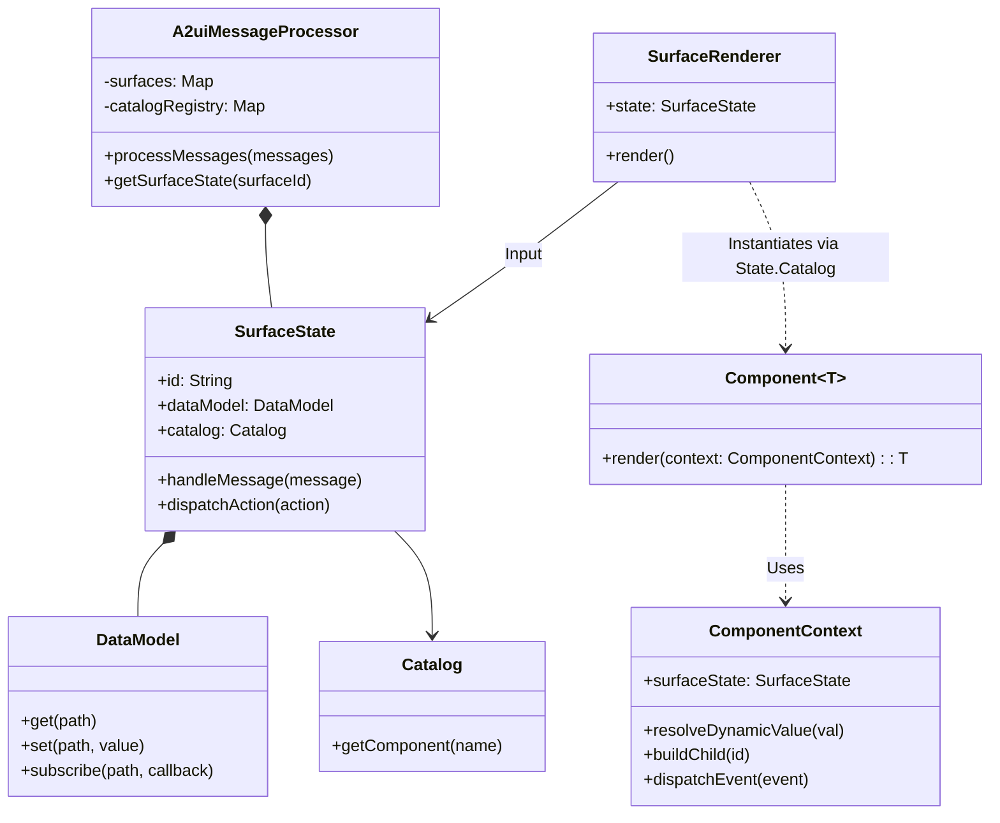

# Web Renderer v0.9 Design Document

**Status:** Draft
**Target Version:** 0.9
**Authors:** Gemini Agent

## Overview

This document outlines the design for the v0.9 Web Renderers (Lit and Angular) for A2UI. The primary goals of this iteration are:

1.  **Centralized Logic:** Move as much state management, data processing, and validation logic as possible into the shared `@a2ui/web_core` library.
2.  **Decoupling:** Decouple the core rendering framework from the `standard_catalog`. The framework should be a generic engine capable of rendering *any* catalog provided to it.
3.  **One-Step Rendering:** Move from a two-step "decode to node -> render node" process to a direct "JSON -> Rendered Output" process within the framework-specific components, utilizing a generic `Catalog` interface.
4.  **Version Coexistence:** Implement v0.9 side-by-side with v0.8 in a `/0.9` directory structure, ensuring no breaking changes for existing v0.8 consumers.

## Architecture

The architecture consists of a shared core library handling state and protocol messages, and framework-specific renderers (Lit, Angular).

The core introduces a `SurfaceState` object which encapsulates the state for a single surface, including its `DataModel` and the current snapshot of component definitions. The `A2uiMessageProcessor` manages these `SurfaceState` objects.

### Key Class Interactions



## API Design

### 1. DataModel (Core)

A standalone, observable data store representing the client-side state. It handles JSON Pointer path resolution and subscription management.

```typescript
// web_core/src/v0_9/state/data-model.ts

export type DataSubscriber = (value: any) => void;
export type Unsubscribe = () => void;

export class DataModel {
  /**
   * Updates the model at the specific path.
   * If path is '/', replaces the entire root.
   */
  set(path: string, value: any): void;

  /**
   * Retrieves data at a specific path.
   * Returns undefined if path does not exist.
   */
  get(path: string): any;

  /**
   * Subscribes to changes at a specific path.
   * The callback is invoked whenever the value at 'path' (or its ancestors/descendants) changes.
   */
  subscribe(path: string, callback: DataSubscriber): Unsubscribe;
}
```

### 2. SurfaceState (Core)

Holds the complete state for a single surface. This acts as the brain for a specific surface, processing messages and exposing state to the renderer.

```typescript
// web_core/src/v0_9/state/surface-state.ts

export type ActionHandler = (action: UserAction) => Promise<void>;

export class SurfaceState {
  readonly id: string;
  readonly dataModel: DataModel;
  readonly catalog: Catalog<any>;
  
  constructor(
    id: string, 
    catalog: Catalog<any>, 
    actionHandler: ActionHandler
  );

  /**
   * The ID of the root component for this surface.
   */
  get rootComponentId(): string | null;

  /**
   * Retrieves the raw component definition (JSON) for a given ID.
   */
  getComponentDefinition(componentId: string): ComponentInstance | undefined;

  /**
   * Processes a single A2UI message targeted at this surface.
   * Updates DataModel or Component definitions accordingly.
   */
  handleMessage(message: ServerToClientMessage): void;

  /**
   * Dispatches a user action to the registered handler.
   */
  dispatchAction(action: UserAction): Promise<void>;
}
```

### 3. Catalog & Component (Core Interface)

The definition of what a Component is, generic over the output type `T` (e.g., `TemplateResult` for Lit).

```typescript
// web_core/src/v0_9/catalog/types.ts

/**
 * A definition of a UI component.
 * @template T The type of the rendered output (e.g. TemplateResult).
 */
export interface Component<T> {
  /** The name of the component as it appears in the A2UI JSON (e.g., 'Button'). */
  name: string;

  /**
   * Renders the component given the context.
   */
  render(context: ComponentContext<T>): T;
}

export interface Catalog<T> {
  id: string;
  /**
   * Retrieves a component definition by name.
   */
  getComponent(name: string): Component<T> | undefined;
}
```

### 4. ComponentContext (Core Interface)

The bridge passed to every component's render method. It provides access to the raw properties, the ability to resolve dynamic values, and the ability to render children.

```typescript
// web_core/src/v0_9/rendering/component-context.ts

export interface ComponentContext<T> {
  /**
   * The unique ID of this component instance.
   */
  readonly id: string;

  /**
   * The raw JSON properties for this component (excluding 'id' and 'component').
   */
  readonly properties: Record<string, any>;

  /**
   * The surface state this component belongs to.
   */
  readonly surfaceState: SurfaceState;

  /**
   * Resolves a dynamic value (literal, path, or function call).
   * This handles creating subscriptions to the DataModel automatically if used within
   * a reactive context (implementation specific).
   */
  resolve<V>(value: DynamicValue<V> | V): V;

  /**
   * Renders a child component by its ID.
   * Returns null if the child does not exist.
   */
  renderChild(childId: string): T | null;

  /**
   * Dispatches a user action back to the system (and server).
   */
  dispatchAction(action: Action): Promise<void>;
}
```

### 5. A2uiMessageProcessor (Core)

The central entry point. It manages the lifecycle of `SurfaceState` objects, routing incoming messages to the correct surface and multiplexing outgoing events.

```typescript
// web_core/src/v0_9/processing/message-processor.ts

export class A2uiMessageProcessor {
  /**
   * @param catalogs A map of available catalogs keyed by their URI.
   * @param actionHandler A global handler for actions from all surfaces.
   */
  constructor(
    private catalogs: Map<string, Catalog<any>>,
    private actionHandler: ActionHandler
  );

  /**
   * Processes a list of server-to-client messages.
   * For `createSurface`, it instantiates a new `SurfaceState` with the correct Catalog.
   * For other messages, it delegates to the appropriate `SurfaceState.handleMessage`.
   */
  processMessages(messages: ServerToClientMessage[]): void;

  /**
   * Gets the SurfaceState for a specific surface ID.
   */
  getSurfaceState(surfaceId: string): SurfaceState | undefined;
}
```

### 5. Base Classes for Standard Catalog (Core)

To reduce code duplication between Lit and Angular, we define abstract base classes for standard components in Core.

```typescript
// web_core/src/v0_9/standard_catalog/base/card-base.ts

import { Component, ComponentContext } from '../../catalog/types';

export abstract class CardBaseComponent<T> implements Component<T> {
  readonly name = 'Card';

  render(context: ComponentContext<T>): T {
    const childId = context.properties['child'];
    // Logic to validate childId could go here
    return this.renderConcrete(context, childId);
  }

  /**
   * Framework-specific implementation.
   */
  protected abstract renderConcrete(
    context: ComponentContext<T>, 
    childId: string
  ): T;
}
```

## Detailed File Structure

### Web Core (`@a2ui/web_core`)

```text
src/
  v0_9/
    index.ts                  # Public API exports
    types/
      messages.ts             # TS interfaces for JSON schemas
      common.ts
    state/
      data-model.ts           # DataModel implementation
      data-model.test.ts
      surface-state.ts        # SurfaceState implementation
    processing/
      message-processor.ts    # A2uiMessageProcessor
      message-processor.test.ts
    catalog/
      types.ts                # Component, Catalog, ComponentContext interfaces
      catalog-registry.ts     # Helper to manage multiple catalogs
    standard_catalog/
      base/                   # Abstract base classes
        text-base.ts
        card-base.ts
        button-base.ts
        ...
      functions/              # Standard function implementations (pure JS/TS)
        logic.ts
        formatting.ts
```

### Lit Renderer (`@a2ui/lit`)

```text
src/
  v0_9/
    index.ts                  # Public exports
    renderer/
      lit-component-context.ts # Implementation of ComponentContext<TemplateResult>
      lit-renderer.ts          # Orchestrates rendering a Surface
    standard_catalog/
      index.ts                 # Exports the catalog definition
      components/              # Concrete implementations of standard components
        text.ts                 # Concrete implementation extending TextBaseComponent
        card.ts
        ...
    ui/
      surface.ts              # <a2ui-surface> custom element
```

### Angular Renderer (`@a2ui/angular`)

```text
src/
  lib/
    v0_9/
      index.ts
      renderer/
        angular-component-context.ts
        renderer.service.ts
      standard_catalog/
        index.ts               # Exports the catalog definition
        components/            # Concrete Angular components for standard catalog
          text.component.ts
          card.component.ts
          ...
      ui/
        surface.component.ts
```

## Renderer Output Formats & Resolution

### Lit
*   **Output Format (`T`):** `TemplateResult` (from `lit-html`).
*   **Dynamic Resolution:** `LitComponentContext.resolve()` uses `@lit-labs/signals` or a similar mechanism to create a signal that updates when the underlying `DataModel` path changes. The `render` method of the component will effectively be a computed signal.

### Angular
*   **Output Format (`T`):** This is trickier in Angular. The "Render" function for an Angular component in this design is actually a factory or a configuration that the `Surface` component uses to dynamically spawn `NgComponentOutlet` or `ViewContainerRef`.
    *   *Proposed:* `T` is an object: `{ type: Type<any>, inputs: Record<string, any> }`.
    *   The `AngularStandardCatalog` returns a mapping to actual Angular Components (`@Component`).
    *   The `render` function in the `Component` interface calculates the inputs based on the context.

## Testing Plan

1.  **Core DataModel**:
    *   Test `set`/`get` with simple values, objects, and arrays.
    *   Test `subscribe` triggers correctly for direct updates, parent updates, and child updates.
2.  **Core MessageProcessor**:
    *   Test processing `createSurface`, `updateComponents`, `updateDataModel`.
    *   Verify internal state matches the message sequence.
3.  **Core Standard Catalog Bases**:
    *   Unit test property parsing and validation logic independent of rendering.
4.  **Framework Renderers**:
    *   **Isolation**: Test individual components (e.g., Lit `Text` component) by passing a mock `ComponentContext`. Verify the output HTML/Template.
    *   **Integration**: Test `Surface` component with a real `A2uiMessageProcessor` and a mock Catalog. Feed it JSON messages and verify the DOM structure.

## Implementation Phasing

1.  **Phase 1: Core Foundation**
    *   Implement `DataModel` with tests.
    *   Implement `A2uiMessageProcessor` (skeleton handling messages) with tests.
    *   Define `Component`, `Catalog`, `ComponentContext` interfaces.

2.  **Phase 2: Standard Catalog Base**
    *   Implement `StandardCatalog` base classes in Core for 2-3 components (e.g., `Text`, `Column`, `Button`).
    *   Implement standard functions logic (string interpolation etc).

3.  **Phase 3: Lit Prototype**
    *   Implement `LitComponentContext`.
    *   Implement `LitStandardCatalog` in the `standard_catalog` directory for the initial 2-3 components.
    *   Implement `<a2ui-surface>` that connects the Processor to the rendering logic.

4.  **Phase 4: Angular Prototype**
    *   Implement `AngularComponentContext`.
    *   Implement `AngularStandardCatalog` in the `standard_catalog` directory and corresponding Angular Components.
    *   Implement `<a2ui-surface>` for Angular.

5.  **Phase 5: Full Standard Catalog**
    *   Flesh out the rest of the components (Inputs, Lists, etc.) in Core and both renderers.

## Open Questions & Answers

*   **Q: Should the surface and a2uimessageprocessor both accept the catalogs?**
    *   **A:** No. `A2uiMessageProcessor` accepts the registry of Catalogs. When `createSurface` is processed, the Processor creates a `SurfaceState` and injects the specific `Catalog` required for that surface. The `Surface` component then accepts the `SurfaceState` as input, giving it access to everything it needs (DataModel, Catalog, Event Dispatcher).
    *   *Decision:* `A2uiMessageProcessor` holds the registry. `SurfaceState` holds the specific instance. `Surface` (Renderer) takes `SurfaceState`.

*   **Q: API for resolving DynamicString?**
    *   **A:** `ComponentContext.resolve<T>(value: DynamicValue<T>): T`. This method encapsulates checking if it's a literal, a path (calling DataModel), or a function (executing logic).

*   **Q: DataModel API?**
    *   **A:** See "API Design > DataModel". It mimics a simplified deep-observable object store.

*   **Q: Renderer Output Format?**
    *   **A:** Lit: `TemplateResult`. Angular: `{ component: Type<any>, inputs: Record<string, any> }` (Representation of a dynamic component).

## Standard catalog implementation

There will be a standard catalog implementation, decoupled from the core renderer in a folder like standard_catalog which has an implementation of the standard catalog.

So in the framework-specific catalog renderers, the standard catalog implementation should be clearly separated from the rendering framework, in the same way as the web core codebase.

The standard catalog implementation for each framework will reside in a `standard_catalog` directory within the framework's package. This directory will export the catalog definition and contain the concrete implementations of the standard components.

## References

*   **v0.9 Spec:** `@specification/v0_9/**`
*   **Existing Lit Renderer:** `@renderers/lit/**`
*   **Flutter Catalog Implementation:** `genui` package (reference for catalog patterns).