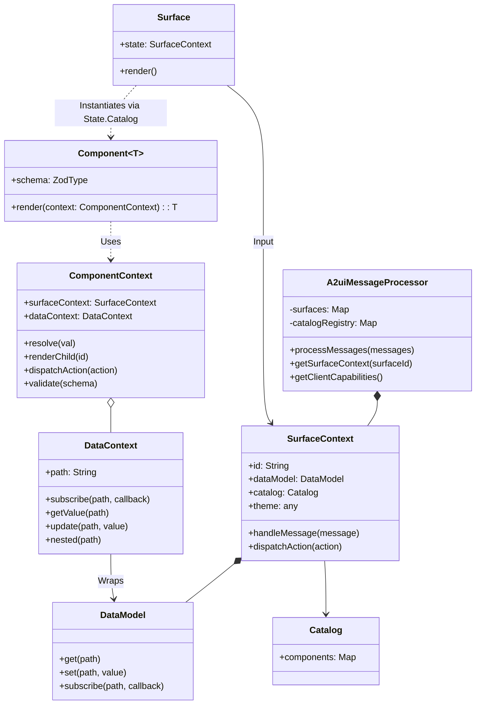

# Web Renderer v0.9 Design Document

**Status:** Draft
**Target Version:** 0.9

## Overview

This document outlines the design for the v0.9 Web Renderers (Lit and Angular) for A2UI. The primary goals of this iteration are:

1.  **Centralized Logic:** Move as much state management, data processing, and validation logic as possible into the shared `@a2ui/web_core` library.
2.  **Decoupling:** Decouple the core rendering framework from the `standard_catalog`. The framework should be a generic engine capable of rendering *any* catalog provided to it.
3.  **One-Step Rendering:** Move from a two-step "decode to node -> render node" process to a direct "JSON -> Rendered Output" process within the framework-specific components, utilizing a generic `Catalog` interface.
4.  **Schema Support:** Implement runtime validation and capability generation using Zod schemas within component definitions.
5.  **Version Coexistence:** Implement v0.9 side-by-side with v0.8 in a `/0.9` directory structure, ensuring no breaking changes for existing v0.8 consumers.

## Architecture

The architecture consists of a shared core library handling state and protocol messages, and framework-specific renderers (Lit, Angular).

The core introduces a `SurfaceContext` object which encapsulates the state for a single surface, including its `DataModel` and the current snapshot of component definitions. The `A2uiMessageProcessor` manages these `SurfaceContext` objects.

### Architecture Overview

The architecture is divided into four distinct layers of responsibility, each with specific classes:

1.  **Web Core Rendering Framework (`@a2ui/web_core`)**:
    *   **Role:** The "Brain". It is the framework-agnostic engine that powers A2UI.
    *   **Responsibilities:** Managing state, processing messages, component traversal, data resolution, and schema validation.
    *   **Key Classes:**
        *   **`A2uiMessageProcessor`**: The central controller that receives messages, manages the lifecycle of surfaces, and generates client capabilities.
        *   **`SurfaceContext`**: The state container for a single surface, holding the `DataModel` and component definitions.
        *   **`DataModel`**: An observable, hierarchical key-value store holding the application data.
        *   **`DataContext`**: A scoped view into the `DataModel` for a specific component.
        *   **`Catalog`**: A generic interface defining a registry of components.
        *   **`Component`**: A generic interface defining how to render a specific UI element given a context, and its Zod schema.
        *   **`ComponentContext`**: The runtime object providing property resolution, tree traversal, and validation logic to components.

2.  **Web Core Standard Catalog Implementation (`@a2ui/web_core/standard_catalog`)**:
    *   **Role:** The "Business Logic" of the standard components.
    *   **Responsibilities:** Defining framework-agnostic behavior, property parsing, schema definitions, and interaction handling.
    *   **Key Classes:** Generic component classes (e.g., `ButtonComponent`, `CardComponent`) that handle protocol logic and delegate rendering via a functional interface.

3.  **Rendering Frameworks (`@a2ui/lit`, `@a2ui/angular`)**:
    *   **Role:** The "Bridge". Connects the generic Core engine to a specific UI framework.
    *   **Responsibilities:** Providing the entry point component and implementing the reactivity bridge.
    *   **Key Classes:**
        *   **`Surface`**: The top-level UI component (e.g., `<a2ui-surface>`) that users drop into their apps.

4.  **Standard Catalog Implementation (Framework Specific)**:
    *   **Role:** The "Painter". Defines the actual pixels and DOM.
    *   **Responsibilities:** Providing visual implementations and wiring them to the generic Core logic via composition.
    *   **Key Classes:** Framework-specific component definitions (e.g., `litButton`, `NgButtonComponent`) and the concrete `Catalog` instance.

### Key Class Interactions



## API Design

### 1. DataModel (Core)

A standalone, observable data store representing the client-side state. It handles JSON Pointer path resolution and subscription management.

```typescript
// web_core/src/v0_9/state/data-model.ts

export type DataSubscriber = (value: any) => void;
export type Unsubscribe = () => void;

export class DataModel {
  /**
   * Updates the model at the specific path.
   * If path is '/', replaces the entire root.
   */
  set(path: string, value: any): void;

  /**
   * Retrieves data at a specific path.
   * Returns undefined if path does not exist.
   */
  get(path: string): any;

  /**
   * Subscribes to changes at a specific path.
   * The callback is invoked whenever the value at 'path' (or its ancestors/descendants) changes.
   */
  subscribe(path: string, callback: DataSubscriber): Unsubscribe;
}

```

### 2. SurfaceContext (Core)

Holds the complete state for a single surface. This acts as the brain for a specific surface, processing messages and exposing state to the renderer.

```typescript
// web_core/src/v0_9/state/surface-state.ts

export type ActionHandler = (action: UserAction) => Promise<void>;

export class SurfaceContext {
  readonly id: string;
  readonly dataModel: DataModel;
  readonly catalog: Catalog<any>;
  readonly theme: any;
  
  constructor(
    id: string, 
    catalog: Catalog<any>, 
    theme: any,
    actionHandler: ActionHandler
  );

  /**
   * The ID of the root component for this surface.
   */
  get rootComponentId(): string | null;

  /**
   * Retrieves the raw component definition (JSON) for a given ID.
   */
  getComponentDefinition(componentId: string): ComponentInstance | undefined;

  /**
   * Processes a single A2UI message targeted at this surface.
   * Updates DataModel or Component definitions accordingly.
   */
  handleMessage(message: ServerToClientMessage): void;

  /**
   * Dispatches a user action to the registered handler.
   */
  dispatchAction(action: UserAction): Promise<void>;
}

```

### 3. DataContext (Core)

A contextual view of the main `DataModel`, used by components to resolve relative and absolute paths. It acts as a localized "window" into the state.

```typescript
// web_core/src/v0_9/state/data-context.ts

export class DataContext {
  constructor(dataModel: DataModel, path: string);

  /**
   * The absolute path this context is currently pointing to.
   */
  readonly path: string;

  /**
   * Subscribes to a path, resolving it against the current context.
   * Returns a function to unsubscribe.
   */
  subscribe<T>(path: string, callback: (value: T) => void): Unsubscribe;

  /**
   * Gets a snapshot value, resolving the path against the current context.
   */
  getValue<T>(path: string): T;

  /**
   * Updates the data model, resolving the path against the current context.
   */
  update(path: string, value: any): void;

  /**
   * Creates a new, nested DataContext for a child component.
   * Used by list/template components for their children.
   */
  nested(relativePath: string): DataContext;
}

```

### 4. Catalog & Component (Core Interface)

The definition of what a Component is, generic over the output type `T` (e.g., `TemplateResult` for Lit). The interface now includes a `schema` property for validation and capability generation.

```typescript
// web_core/src/v0_9/catalog/types.ts
import { z } from 'zod';

/**
 * A definition of a UI component.
 * @template T The type of the rendered output (e.g. TemplateResult).
 */
export interface Component<T> {
  /** The name of the component as it appears in the A2UI JSON (e.g., 'Button'). */
  readonly name: string;

  /**
   * The Zod schema describing the **custom properties** of this component.
   * This should NOT include 'component', 'id', 'weight', or 'accessibility' 
   * as those are handled by the framework/envelope.
   */
  readonly schema: z.ZodType<any>;

  /**
   * Renders the component given the context.
   */
  render(context: ComponentContext<T>): T;
}

export interface Catalog<T> {
  id: string;
  
  /** 
   * A map of available components. 
   * This is readonly to encourage immutable extension patterns.
   */
  readonly components: ReadonlyMap<string, Component<T>>;
}
```

### 5. ComponentContext (Core)

A generic, concrete class that implements the core logic for property resolution, tree traversal, and validation.

```typescript
// web_core/src/v0_9/rendering/component-context.ts

export class ComponentContext<T> {
  constructor(
    readonly id: string,
    readonly properties: Record<string, any>,
    readonly dataContext: DataContext,
    readonly surfaceContext: SurfaceContext,
    private readonly updateCallback: () => void
  ) {}

  /**
   * Resolves a dynamic value (literal, path, or function call).
   */
  resolve<V>(value: DynamicValue<V> | V): V { /* ... */ }

  /**
   * Renders a child component by its ID.
   */
  renderChild(childId: string): T | null { /* ... */ }

  dispatchAction(action: Action): Promise<void> { /* ... */ }

  /**
   * Validates the current component properties against the provided schema.
   * Logs warnings if validation fails (lazy validation).
   */
  validate(schema: z.ZodType<any>): boolean {
    const result = schema.safeParse(this.properties);
    if (!result.success) {
      console.warn(`Validation failed for ${this.id}:`, result.error);
      return false;
    }
    return true;
  }
}
```

### 6. A2uiMessageProcessor (Core)

The central entry point. It manages the lifecycle of `SurfaceContext` objects and generates client capabilities by transforming Zod schemas into JSON Schemas.

```typescript
// web_core/src/v0_9/processing/message-processor.ts

export interface ClientCapabilitiesOptions {
  /**
   * A list of Catalog instances that should be serialized 
   * and sent as 'inlineCatalogs'.
   */
  inlineCatalogs?: Catalog<any>[];
}

export class A2uiMessageProcessor {
  constructor(
    private catalogs: Map<string, Catalog<any>>,
    private actionHandler: ActionHandler
  );

  processMessages(messages: ServerToClientMessage[]): void;

  getSurfaceContext(surfaceId: string): SurfaceContext | undefined;

  /**
   * Generates the a2uiClientCapabilities object, converting component schemas
   * to JSON Schema format with correct references.
   */
  getClientCapabilities(options: ClientCapabilitiesOptions = {}): any;
}
```

### 7. Standard Catalog Components (Core & Frameworks)

Components now define their schema using Zod. Common types are imported from a shared `schema_types` module to ensure generated JSON schemas use the correct `$ref` pointers.

#### A. Core Logic (Generic)

```typescript
import { z } from 'zod';
import { Component } from '../../catalog/types';
import { CommonTypes } from '../../catalog/schema_types';

const buttonSchema = z.object({
  child: CommonTypes.ComponentId.describe('The ID of the child component...'),
  variant: z.enum(['primary', 'borderless']).optional().describe('A hint for the button style...'),
  action: CommonTypes.Action,
  enabled: z.boolean().optional().default(true) 
});

export class ButtonComponent<T> implements Component<T> {
  readonly name = 'Button';
  readonly schema = buttonSchema;

  constructor(private readonly renderer: (props: ButtonRenderProps<T>) => T) {}

  render(context: ComponentContext<T>): T {
    // context.validate(this.schema); 
    // ... render logic
  }
}
```

### 8. Schema Support and Inline Catalogs

This design enables `Catalog` and `Component` definitions to be self-describing using Zod. This allows:

1.  **Runtime Validation:** The core framework can validate incoming component properties against their schema during rendering, ensuring robustness.
2.  **Capability Discovery:** The client can generate a machine-readable definition of its supported components (including custom ones) to send to the server via `clientCapabilities`.

**Schema Generation:**

The `A2uiMessageProcessor.getClientCapabilities` method transforms Zod schemas into the specific JSON Schema format required by the A2UI protocol. It handles:
*   Converting Zod types to JSON Schema.
*   Resolving shared type references (like `DynamicString`) to `common_types.json`.
*   Wrapping the component schema in the standard A2UI envelope (mixins for ID, accessibility, etc.).
*   Generating the `oneOf` union for `anyComponent`.

## Detailed File Structure

### Web Core (`@a2ui/web_core`)

```text
src/
  v0_9/
    index.ts
    types/
      messages.ts
      common.ts
    state/
      data-model.ts
      surface-state.ts
      data-context.ts
    processing/
      message-processor.ts    # Now includes capability generation
    catalog/
      types.ts                # Component interface updated with schema
      schema_types.ts         # Common Zod types with reference tagging
      catalog-registry.ts
    rendering/
      component-context.ts    # Now includes validate()
    standard_catalog/
      factory.ts
      components/             # Components updated with schemas
        text.ts
        card.ts
        button.ts
        ...
```
