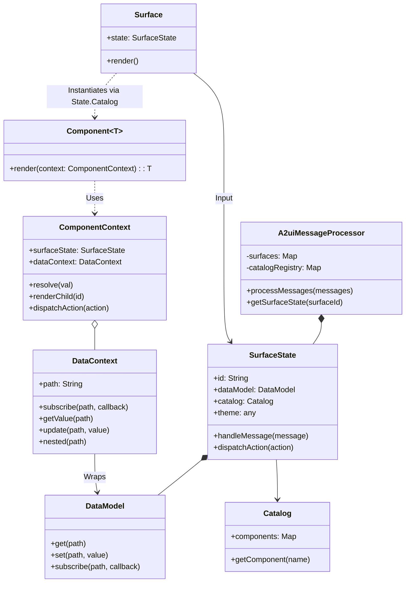

# Web Renderer v0.9 Design Document

**Status:** Draft
**Target Version:** 0.9
**Authors:** Gemini Agent

## Overview

This document outlines the design for the v0.9 Web Renderers (Lit and Angular) for A2UI. The primary goals of this iteration are:

1.  **Centralized Logic:** Move as much state management, data processing, and validation logic as possible into the shared `@a2ui/web_core` library.
2.  **Decoupling:** Decouple the core rendering framework from the `standard_catalog`. The framework should be a generic engine capable of rendering *any* catalog provided to it.
3.  **One-Step Rendering:** Move from a two-step "decode to node -> render node" process to a direct "JSON -> Rendered Output" process within the framework-specific components, utilizing a generic `Catalog` interface.
4.  **Version Coexistence:** Implement v0.9 side-by-side with v0.8 in a `/0.9` directory structure, ensuring no breaking changes for existing v0.8 consumers.

## Architecture

The architecture consists of a shared core library handling state and protocol messages, and framework-specific renderers (Lit, Angular).

The core introduces a `SurfaceState` object which encapsulates the state for a single surface, including its `DataModel` and the current snapshot of component definitions. The `A2uiMessageProcessor` manages these `SurfaceState` objects.

### Architecture Overview

The architecture is divided into four distinct layers of responsibility, each with specific classes:

1.  **Web Core Rendering Framework (`@a2ui/web_core`)**:
    *   **Role:** The "Brain". It is the framework-agnostic engine that powers A2UI.
    *   **Responsibilities:** Managing state, processing messages, component traversal, and data resolution.
    *   **Key Classes:**
        *   **`A2uiMessageProcessor`**: The central controller that receives messages and manages the lifecycle of surfaces.
        *   **`SurfaceState`**: The state container for a single surface, holding the `DataModel` and component definitions.
        *   **`DataModel`**: An observable, hierarchical key-value store holding the application data.
        *   **`DataContext`**: A scoped view into the `DataModel` for a specific component.
        *   **`Catalog`**: A generic interface defining a registry of components.
        *   **`Component`**: A generic interface defining how to render a specific UI element given a context.
        *   **`ComponentContext`**: The runtime object providing property resolution and tree traversal logic to components.

2.  **Web Core Standard Catalog Implementation (`@a2ui/web_core/standard_catalog`)**:
    *   **Role:** The "Business Logic" of the standard components.
    *   **Responsibilities:** Defining framework-agnostic behavior, property parsing, and interaction handling.
    *   **Key Classes:** Generic component classes (e.g., `ButtonComponent`, `CardComponent`) that handle protocol logic and delegate rendering via a functional interface.

3.  **Rendering Frameworks (`@a2ui/lit`, `@a2ui/angular`)**:
    *   **Role:** The "Bridge". Connects the generic Core engine to a specific UI framework.
    *   **Responsibilities:** Providing the entry point component and implementing the reactivity bridge.
    *   **Key Classes:**
        *   **`Surface`**: The top-level UI component (e.g., `<a2ui-surface>`) that users drop into their apps.

4.  **Standard Catalog Implementation (Framework Specific)**:
    *   **Role:** The "Painter". Defines the actual pixels and DOM.
    *   **Responsibilities:** Providing visual implementations and wiring them to the generic Core logic via composition.
    *   **Key Classes:** Framework-specific component definitions (e.g., `litButton`, `NgButtonComponent`) and the concrete `Catalog` instance.

### Key Class Interactions



## API Design

### 1. DataModel (Core)

A standalone, observable data store representing the client-side state. It handles JSON Pointer path resolution and subscription management.

```typescript
// web_core/src/v0_9/state/data-model.ts

export type DataSubscriber = (value: any) => void;
export type Unsubscribe = () => void;

export class DataModel {
  /**
   * Updates the model at the specific path.
   * If path is '/', replaces the entire root.
   */
  set(path: string, value: any): void;

  /**
   * Retrieves data at a specific path.
   * Returns undefined if path does not exist.
   */
  get(path: string): any;

  /**
   * Subscribes to changes at a specific path.
   * The callback is invoked whenever the value at 'path' (or its ancestors/descendants) changes.
   */
  subscribe(path: string, callback: DataSubscriber): Unsubscribe;
}

```

### 2. SurfaceState (Core)

Holds the complete state for a single surface. This acts as the brain for a specific surface, processing messages and exposing state to the renderer.

```typescript
// web_core/src/v0_9/state/surface-state.ts

export type ActionHandler = (action: UserAction) => Promise<void>;

export class SurfaceState {
  readonly id: string;
  readonly dataModel: DataModel;
  readonly catalog: Catalog<any>;
  readonly theme: any;
  
  constructor(
    id: string, 
    catalog: Catalog<any>, 
    theme: any,
    actionHandler: ActionHandler
  );

  /**
   * The ID of the root component for this surface.
   */
  get rootComponentId(): string | null;

  /**
   * Retrieves the raw component definition (JSON) for a given ID.
   */
  getComponentDefinition(componentId: string): ComponentInstance | undefined;

  /**
   * Processes a single A2UI message targeted at this surface.
   * Updates DataModel or Component definitions accordingly.
   */
  handleMessage(message: ServerToClientMessage): void;

  /**
   * Dispatches a user action to the registered handler.
   */
  dispatchAction(action: UserAction): Promise<void>;
}

```

### 3. DataContext (Core)

A contextual view of the main `DataModel`, used by components to resolve relative and absolute paths. It acts as a localized "window" into the state.

```typescript
// web_core/src/v0_9/state/data-context.ts

export class DataContext {
  constructor(dataModel: DataModel, path: string);

  /**
   * The absolute path this context is currently pointing to.
   */
  readonly path: string;

  /**
   * Subscribes to a path, resolving it against the current context.
   * Returns a function to unsubscribe.
   */
  subscribe<T>(path: string, callback: (value: T) => void): Unsubscribe;

  /**
   * Gets a snapshot value, resolving the path against the current context.
   */
  getValue<T>(path: string): T;

  /**
   * Updates the data model, resolving the path against the current context.
   */
  update(path: string, value: any): void;

  /**
   * Creates a new, nested DataContext for a child component.
   * Used by list/template components for their children.
   */
  nested(relativePath: string): DataContext;
}

```

### 4. Catalog & Component (Core Interface)

The definition of what a Component is, generic over the output type `T` (e.g., `TemplateResult` for Lit).

```typescript
// web_core/src/v0_9/catalog/types.ts

/**
 * A definition of a UI component.
 * @template T The type of the rendered output (e.g. TemplateResult).
 */
export interface Component<T> {
  /** The name of the component as it appears in the A2UI JSON (e.g., 'Button'). */
  name: string;

  /**
   * Renders the component given the context.
   */
  render(context: ComponentContext<T>): T;
}

export interface Catalog<T> {
  id: string;
  
  /** 
   * A map of available components. 
   * This is readonly to encourage immutable extension patterns.
   */
  readonly components: ReadonlyMap<string, Component<T>>;

  /**
   * Retrieves a component definition by name.
   * This can be a convenience wrapper around the map or handle fallback logic.
   */
  getComponent(name: string): Component<T> | undefined;

  // Note: Functions will also be defined here in future iterations
  // readonly functions: ReadonlyMap<string, FunctionDefinition>;
}
```

### 5. ComponentContext (Core)

A generic, concrete class that implements the core logic for property resolution and tree traversal. It is initialized with a callback to trigger the specific renderer's update mechanism.

```typescript
// web_core/src/v0_9/rendering/component-context.ts

export class ComponentContext<T> {
  constructor(
    readonly id: string,
    readonly properties: Record<string, any>,
    readonly dataContext: DataContext,
    readonly surfaceState: SurfaceState,
    private readonly updateCallback: () => void
  ) {}

  /**
   * Resolves a dynamic value (literal, path, or function call).
   * When the underlying data changes, it calls `this.updateCallback()`.
   */
  resolve<V>(value: DynamicValue<V> | V): V {
    // 1. Literal Check: If it's a primitive, return it directly.
    if (typeof value !== 'object' || value === null) {
      return value as V;
    }

    // 2. Path Check: If it's a data binding { path: "..." }
    if ('path' in value) {
      // Subscribe to changes. When data changes, trigger a re-render.
      // Note: DataContext handles unsubscribing when it is disposed/GC'd (conceptually)
      // or we might need a cleanup phase in ComponentContext.
      this.dataContext.subscribe(value.path, () => this.updateCallback());
      return this.dataContext.getValue(value.path);
    }

    // 3. Function Call: If it's { call: "...", args: ... }
    if ('call' in value) {
      // Execute the function logic (implementation in Core)
      // This might involve recursive resolution of args.
      // return executeFunction(value, this);
    }

    return value as V;
  }

  /**
   * Renders a child component by its ID.
   * 1. Looks up the component definition in SurfaceState.
   * 2. Looks up the Component implementation in the Catalog.
   * 3. Creates a new nested ComponentContext, propagating the updateCallback.
   * 4. Calls `component.render(childContext)`.
   */
  renderChild(childId: string): T | null {
    const def = this.surfaceState.getComponentDefinition(childId);
    if (!def) return null;

    const component = this.surfaceState.catalog.getComponent(def.type);
    if (!component) return null;

    // The A2uiMessageProcessor has already calculated the correct data path for this component instance
    const childPath = def.dataContextPath ?? '/';
    const childDataContext = new DataContext(this.surfaceState.dataModel, childPath);

    const childCtx = new ComponentContext<T>(
      def.id,
      def.properties,
      childDataContext,
      this.surfaceState,
      this.updateCallback
    );

    return component.render(childCtx);
  }

  dispatchAction(action: Action): Promise<void> {
    return this.surfaceState.dispatchAction(action);
  }
}

```

### 6. A2uiMessageProcessor (Core)

The central entry point. It manages the lifecycle of `SurfaceState` objects, routing incoming messages to the correct surface and multiplexing outgoing events.

```typescript
// web_core/src/v0_9/processing/message-processor.ts

export class A2uiMessageProcessor {
  /**
   * @param catalogs A map of available catalogs keyed by their URI.
   * @param actionHandler A global handler for actions from all surfaces.
   */
  constructor(
    private catalogs: Map<string, Catalog<any>>,
    private actionHandler: ActionHandler
  );

  /**
   * Processes a list of server-to-client messages.
   * For `createSurface`, it instantiates a new `SurfaceState` with the correct Catalog.
   * For other messages, it delegates to the appropriate `SurfaceState.handleMessage`.
   */
  processMessages(messages: ServerToClientMessage[]): void;

  /**
   * Gets the SurfaceState for a specific surface ID.
   */
  getSurfaceState(surfaceId: string): SurfaceState | undefined;
}

```

### 7. Standard Catalog Components (Core & Frameworks)

To reduce code duplication between Lit and Angular, we define concrete, generic component classes in Core that handle the protocol logic and delegate rendering via a functional interface (composition). This example illustrates the pattern using the **Button** component.

#### A. Core Logic (Generic)
Location: `@a2ui/web_core/src/v0_9/standard_catalog/components/button.ts`

```typescript
import { Component } from '../../catalog/types';
import { ComponentContext } from '../../rendering/component-context';

export interface ButtonRenderProps<T> {
  childContent: T | null;
  variant: 'primary' | 'borderless' | 'default';
  disabled: boolean;
  onAction: () => void;
}

export class ButtonComponent<T> implements Component<T> {
  readonly name = 'Button';

  constructor(private readonly renderer: (props: ButtonRenderProps<T>) => T) {}

  render(context: ComponentContext<T>): T {
    const { properties } = context;
    const childId = properties['child'] as string;
    const variant = (properties['variant'] as string) || 'default';
    const isEnabled = context.resolve<boolean>(properties['enabled'] ?? true);
    const action = properties['action'];

    const onAction = () => {
      if (isEnabled && action) {
        context.dispatchAction(action);
      }
    };

    return this.renderer({
      childContent: context.renderChild(childId),
      variant: variant as any,
      disabled: !isEnabled,
      onAction
    });
  }
}
```

#### B. Lit Implementation
Location: `@a2ui/lit/src/v0_9/standard_catalog/components/button.ts`

```typescript
export const litButton = new ButtonComponent<TemplateResult>(
  (props: ButtonRenderProps<TemplateResult>) => html`
    <button class="variant-${props.variant}" ?disabled=${props.disabled} @click=${props.onAction}>
      ${props.childContent}
    </button>
  `
);
```

#### C. Angular Implementation
Location: `@a2ui/angular/src/lib/v0_9/standard_catalog/components/button.ts`

```typescript
export const angularButton = new ButtonComponent<RenderableDefinition>(
  (props: ButtonRenderProps<RenderableDefinition>) => ({
    componentType: NgButtonComponent,
    inputs: { variant: props.variant, disabled: props.disabled, child: props.childContent },
    outputs: { action: props.onAction }
  })
);
```


### 8. Lit Renderer Implementation Example

This example demonstrates how the Lit implementation of the Surface component orchestrates the rendering process, including creating the `ComponentContext` with the necessary callbacks.

```typescript
// @a2ui/lit/src/v0_9/ui/surface.ts

@customElement('a2ui-surface')
export class Surface extends LitElement {
  @property({ attribute: false })
  state?: SurfaceState;

  // Reactivity: Subscribe to SurfaceState changes (or DataModel changes)
  // Since we pass 'this.requestUpdate' to the context, components will call it when data changes.
  
  render() {
    if (!this.state || !this.state.rootComponentId) return nothing;

    // 1. Get Root Definition
    const rootId = this.state.rootComponentId;
    const rootDef = this.state.getComponentDefinition(rootId);
    if (!rootDef) return nothing;

    // 2. Create Context
    // We pass a bound version of requestUpdate so components can trigger re-renders.
    const context = new ComponentContext<TemplateResult>(
      rootId,
      rootDef.properties,
      new DataContext(this.state.dataModel, rootDef.dataContextPath ?? '/'),
      this.state,
      () => this.requestUpdate() 
    );

    // 3. Render Root
    const component = this.state.catalog.getComponent(rootDef.type);
    if (!component) return html`Unknown component: ${rootDef.type}`;

    return component.render(context);
  }
}
```

### 9. SurfaceRenderer (Framework Specific)

The `SurfaceRenderer` (typically exported as `Surface`) is the top-level component that users place in their applications. It serves as the gateway between the framework's DOM and the A2UI state.

```typescript
// Interface for the component's inputs
export interface SurfaceProps {
  /**
   * The complete state for this surface, obtained from A2uiMessageProcessor.
   */
  state: SurfaceState;
}
```

**Responsibilities:**
1.  **Reactivity**: It observes the `SurfaceState`. When the `rootComponentId` changes, or when component definitions are updated, it triggers a re-render.
2.  **Theming**: It reads `SurfaceState.theme` and applies it to the surface container, typically by generating CSS Custom Properties (variables) like `--a2ui-primary-color`.
3.  **Root Orchestration**: It identifies the component definition for 'root', instantiates the framework-specific `ComponentContext`, and calls the root component's `render()` method.
4.  **Error Boundaries**: It provides a top-level catch for rendering errors within the surface.

## Detailed File Structure

### Web Core (`@a2ui/web_core`)

```text
src/
  v0_9/
    index.ts                  # Public API exports
    types/
      messages.ts             # TS interfaces for JSON schemas
      common.ts
    state/
      data-model.ts           # DataModel implementation
      data-model.test.ts
      surface-state.ts        # SurfaceState implementation
      data-context.ts         # DataContext implementation
    processing/
      message-processor.ts    # A2uiMessageProcessor
      message-processor.test.ts
    catalog/
      types.ts                # Component, Catalog interfaces
      catalog-registry.ts     # Helper to manage multiple catalogs
    rendering/
      component-context.ts    # ComponentContext implementation
    standard_catalog/
      factory.ts              # Strict catalog factory
      components/             # Generic component classes
        text.ts
        card.ts
        button.ts
        ...
      functions/              # Standard function implementations (pure JS/TS)
        logic.ts
        formatting.ts
```

### Lit Renderer (`@a2ui/lit`)

```text
src/
  v0_9/
    index.ts                  # Public exports
    renderer/
      lit-component-context.ts # Implementation of ComponentContext<TemplateResult>
      lit-renderer.ts          # Orchestrates rendering a Surface
    standard_catalog/
      index.ts                 # Exports the catalog definition
      components/              # Concrete implementations of standard components
        text.ts                 # Concrete implementation extending TextBaseComponent
        card.ts
        ...
    ui/
      surface.ts              # <a2ui-surface> custom element
```

### Angular Renderer (`@a2ui/angular`)

```text
src/
  lib/
    v0_9/
      index.ts
      renderer/
        angular-component-context.ts
        renderer.service.ts
      standard_catalog/
        index.ts               # Exports the catalog definition
        components/            # Concrete Angular components for standard catalog
          text.component.ts
          card.component.ts
          ...
      ui/
        surface.component.ts
```


### Binding to A2UI (Catalog Registration)

To ensure consistency across different renderers, `@a2ui/web_core` provides a strict interface and a factory function. This enforces that every renderer implements the full set of components required by the A2UI Standard Catalog.

#### 1. Core Factory Utility
Location: `@a2ui/web_core/src/v0_9/standard_catalog/factory.ts`

```typescript
import { Component, Catalog } from '../catalog/types';

/**
 * Strict contract for the Standard Catalog. 
 * Add all standard components here to enforce implementation in all renderers.
 */
export interface StandardCatalogComponents<T> {
  Button: Component<T>;
  Text: Component<T>;
  Column: Component<T>;
  Row: Component<T>;
  // ... other standard components
}

export function createStandardCatalog<T>(
  components: StandardCatalogComponents<T>
): Catalog<T> {
  const componentMap = new Map<string, Component<T>>(
    Object.entries(components) as [string, Component<T>][]
  );

  return {
    id: 'https://a2ui.org/specification/v0_9/standard_catalog.json',
    components: componentMap,
    getComponent(name: string) {
      return this.components.get(name);
    }
  };
}
```

#### 2. Framework Usage (Lit Example)
Location: `@a2ui/lit/src/v0_9/standard_catalog/index.ts`

```typescript
import { createStandardCatalog } from '@a2ui/web_core/v0_9/standard_catalog/factory';
import { litButton } from './components/button';
import { litText } from './components/text';

export function createLitStandardCatalog(): Catalog<TemplateResult> {
  // TypeScript will enforce that all components defined in 
  // StandardCatalogComponents are provided here.
  return createStandardCatalog({
    Button: litButton,
    Text: litText,
    Column: litColumn,
    Row: litRow,
  });
}
```

### Creating a Custom Catalog

Developers can create custom catalogs by combining the standard catalog with their own components. This is done by creating a new `Catalog` implementation that merges the standard component map with custom definitions.

```typescript
// my-app/src/custom-catalog.ts

import { createLitStandardCatalog } from '@a2ui/lit';
import { Catalog, Component } from '@a2ui/web_core/v0_9/catalog/types';
import { html, TemplateResult } from 'lit';
import { ComponentContext } from '@a2ui/web_core/v0_9/rendering/component-context';

// 1. Define a Custom Component
class MyCustomComponent implements Component<TemplateResult> {
  readonly name = 'MyCustomComponent';

  render(context: ComponentContext<TemplateResult>): TemplateResult {
    const title = context.resolve<string>(context.properties['title'] ?? 'Custom');
    return html`<div class="my-custom-widget">Special: ${title}</div>`;
  }
}

// 2. Create the Custom Catalog
export function createMyCustomCatalog(): Catalog<TemplateResult> {
  // Start with the standard catalog
  const standardCatalog = createLitStandardCatalog();
  
  // Create a new map seeded with standard components
  const components = new Map<string, Component<TemplateResult>>(
    standardCatalog.components
  );

  // Add (or override) components
  components.set('MyCustomComponent', new MyCustomComponent());

  return {
    id: 'https://myapp.com/catalog/v1',
    components,
    getComponent(name: string) {
      return this.components.get(name);
    }
  };
}
```

## Renderer Output Formats & Resolution

### Lit
*   **Output Format (`T`):** `TemplateResult` (from `lit-html`).
*   **Dynamic Resolution:** `LitComponentContext.resolve()` uses `@lit-labs/signals` or a similar mechanism to create a signal that updates when the underlying `DataModel` path changes. The `render` method of the component will effectively be a computed signal.

### Angular
*   **Output Format (`T`):** This is trickier in Angular. The "Render" function for an Angular component in this design is actually a factory or a configuration that the `Surface` component uses to dynamically spawn `NgComponentOutlet` or `ViewContainerRef`.
    *   *Proposed:* `T` is an object: `{ type: Type<any>, inputs: Record<string, any> }`.
    *   The `AngularStandardCatalog` returns a mapping to actual Angular Components (`@Component`).
    *   The `render` function in the `Component` interface calculates the inputs based on the context.

## Testing Plan

1.  **Core DataModel**:
    *   Test `set`/`get` with simple values, objects, and arrays.
    *   Test `subscribe` triggers correctly for direct updates, parent updates, and child updates.
2.  **Core MessageProcessor**:
    *   Test processing `createSurface`, `updateComponents`, `updateDataModel`.
    *   Verify internal state matches the message sequence.
3.  **Core Standard Catalog Bases**:
    *   Unit test property parsing and validation logic independent of rendering.
4.  **Framework Renderers**:
    *   **Isolation**: Test individual components (e.g., Lit `Text` component) by passing a mock `ComponentContext`. Verify the output HTML/Template.
    *   **Integration**: Test `Surface` component with a real `A2uiMessageProcessor` and a mock Catalog. Feed it JSON messages and verify the DOM structure.

## Implementation Phasing

1.  **Phase 1: Core Foundation**
    *   Implement `DataModel` with tests.
    *   Implement `A2uiMessageProcessor` (skeleton handling messages) with tests.
    *   Define `Component`, `Catalog`, `ComponentContext` interfaces.

2.  **Phase 2: Standard Catalog Components (Core)**
    *   Implement `StandardCatalog` generic component classes in Core for 2-3 components (e.g., `Text`, `Column`, `Button`).
    *   Implement standard functions logic (string interpolation etc).

3.  **Phase 3: Lit Prototype**
    *   Implement `LitComponentContext`.
    *   Implement `LitStandardCatalog` in the `standard_catalog` directory for the initial 2-3 components.
    *   Implement `<a2ui-surface>` that connects the Processor to the rendering logic.

4.  **Phase 4: Angular Prototype**
    *   Implement `AngularComponentContext`.
    *   Implement `AngularStandardCatalog` in the `standard_catalog` directory and corresponding Angular Components.
    *   Implement `<a2ui-surface>` for Angular.

5.  **Phase 5: Full Standard Catalog**
    *   Flesh out the rest of the components (Inputs, Lists, etc.) in Core and both renderers.

## Open Questions & Answers

*   **Q: Should the surface and a2uimessageprocessor both accept the catalogs?**
    *   **A:** No. `A2uiMessageProcessor` accepts the registry of Catalogs. When `createSurface` is processed, the Processor creates a `SurfaceState` and injects the specific `Catalog` required for that surface. The `Surface` component then accepts the `SurfaceState` as input, giving it access to everything it needs (DataModel, Catalog, Event Dispatcher).
    *   *Decision:* `A2uiMessageProcessor` holds the registry. `SurfaceState` holds the specific instance. `Surface` (Renderer) takes `SurfaceState`.

*   **Q: API for resolving DynamicString?**
    *   **A:** `ComponentContext.resolve<T>(value: DynamicValue<T>): T`. This method encapsulates checking if it's a literal, a path (calling DataModel), or a function (executing logic).

*   **Q: DataModel API?**
    *   **A:** See "API Design > DataModel". It mimics a simplified deep-observable object store.

*   **Q: Renderer Output Format?**
    *   **A:** Lit: `TemplateResult`. Angular: `{ component: Type<any>, inputs: Record<string, any> }` (Representation of a dynamic component).

## Standard catalog implementation

There will be a standard catalog implementation, decoupled from the core renderer in a folder like standard_catalog which has an implementation of the standard catalog.

So in the framework-specific catalog renderers, the standard catalog implementation should be clearly separated from the rendering framework, in the same way as the web core codebase. This is achieved by having the generic logic in Core and the framework-specific rendering functions in the renderer packages.

The standard catalog implementation for each framework will reside in a `standard_catalog` directory within the framework's package. This directory will export the catalog definition and contain the concrete implementations of the standard components.

## Renderer Structure Differences: v0.8 vs v0.9

This section outlines the architectural and structural differences between the existing v0.8 A2UI web renderers and the proposed v0.9 design.

### 1. Codebase Structure & Responsibilities

*   **v0.8 (Current)**:
    *   **Core**: Contains types and basic message processing. Logic is scattered.
    *   **Renderers**: Hold the bulk of the logic and strictly typed component nodes.
*   **v0.9 (Proposed)**:
    *   **Core**: Becomes the "Brain", handling State (`DataModel`, `SurfaceState`) and Base Logic (Generic `ButtonComponent`, `TextComponent`, etc. which handle protocol tasks).
    *   **Renderers**: Become thinner "View" layers, implementing `ComponentContext` and providing concrete renderer functions for standard components.

### 2. Component Implementation & "Node" Intermediate Representation

*   **v0.8**: Uses a two-step process: Decode JSON to strict `AnyComponentNode` tree -> Render. Adding a component requires updating Core types.
*   **v0.9**: Removes the "Node" IR. Components access raw JSON properties via `ComponentContext`. Logic is driven by the component implementation itself, making the core framework extensible without type changes.

### 3. Custom Components & Catalog Management

*   **v0.8**: Uses a singleton registry or static maps. Hard to scope components per surface.
*   **v0.9**: Introduces `Catalog` instances. A `Surface` is initialized with a specific `Catalog`, allowing easy scoping and composition.

**Example: Adding a "Map" component by extending the standard catalog**

```typescript
import { createLitStandardCatalog } from '@a2ui/lit';
import { MapComponent } from './my-map-component';

const standardCatalog = createLitStandardCatalog();
const components = new Map(standardCatalog.components);

// Add custom component
components.set('Map', new MapComponent());

const myAppCatalog: Catalog<TemplateResult> = {
  id: 'https://myapp.com/catalog',
  components, 
  getComponent(name) { return this.components.get(name); }
};

processor.registerCatalog(myAppCatalog);
```

### 4. Data Binding & State

*   **v0.8**: Data managed as a flat map. Binding logic manual in components. Reactivity implicit.
*   **v0.9**: Data managed by `SurfaceState` -> `DataModel`. Components use `context.resolve(value)` which automatically subscribes the rendering context to the specific data path, ensuring precise updates.

### Summary Table

| Feature             | v0.8                                        | v0.9                                 |
| :------------------ | :------------------------------------------ | :----------------------------------- |
| **Parsing**         | JSON -> `AnyComponentNode` (Typed)          | JSON -> Raw Properties (Untyped)     |
| **Component Logic** | Duplicated in Renderers                     | Centralized in Core Generic Classes  |
| **Registry**        | Singleton / Static Map                      | `Catalog` Interface (Instance based) |
| **Extensibility**   | Register globally                           | Compose/Wrap Catalog objects         |
| **State Scope**     | Global (mostly)                             | Scoped to `SurfaceState`             |
| **Surface Entry**   | `<surface surfaceId="..." processor="...">` | `<surface .state="...">`             |

## References

*   **v0.9 Spec:** `@specification/v0_9/**`
*   **Existing Lit Renderer:** `@renderers/lit/**`
*   **Flutter Catalog Implementation:** `genui` package (reference for catalog patterns).